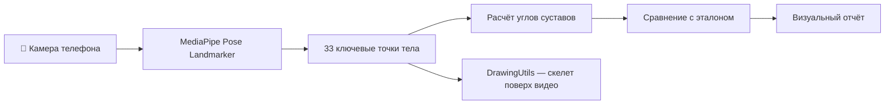
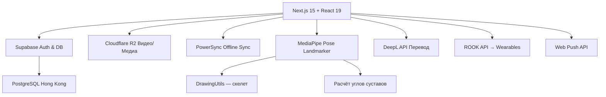

# 🔬 Исследование: Фичи, API и Интеграции для Энциклопедии Прыгуна v2

> **Дата:** 15 февраля 2026  
> **Навыки:** `brainstorming`, `concise-planning`, `kaizen`  
> **NotebookLM:** [Доска исследования](https://notebooklm.google.com/notebook/f1247bc4-e430-44a8-9d67-39f7ae419ebb) — **23 источника, 77 найдено**  
> **NotebookLM:** [Доска периодизации](https://notebooklm.google.com/notebook/9b25eb95-490f-4471-82b5-4cdbf36ad0a7) — **5 источников + deep research**  
> **Источники:** 9 веб-поисков + 2x Deep Research + Fast Research MediaPipe + 3x AI Query

---

## 📋 Содержание

1. [Базы упражнений с картинками](#базы-упражнений)
2. [Самые полезные фичи для тренеров](#полезные-фичи)
3. [🧠 AI-рекомендации NotebookLM](#ai-рекомендации)
4. [🏗️ Конструктор тренировок](#конструктор-тренировок)
5. [🏆 Платформы-конкуренты для тренеров](#платформы-конкуренты)
6. [API и интеграции](#api-и-интеграции)
7. [📐 MediaPipe и биомеханика](#mediapipe)
8. [Специализированные инструменты для прыжков](#специализированные-инструменты)
9. [📊 Тренды 2026 из Deep Research](#тренды-2026)
10. [Архитектурные решения](#архитектурные-решения)
11. [Рекомендуемый роадмап](#роадмап)

---

## 🗄️ Базы упражнений с картинками {#базы-упражнений}

### 1. ExerciseDB API (⭐ Лучший выбор)
| Параметр | Значение |
|---|---|
| **Упражнений** | 1,500+ (v1 open-source), 11,000+ (v2) |
| **Медиа** | GIF-анимации с подсветкой мышц |
| **Данные** | Целевые мышцы, оборудование, части тела |
| **Лицензия** | v1 — полностью open-source |
| **API** | REST API, JSON |
| **Сайт** | [exercisedb.dev](https://exercisedb.dev) |

> [!TIP]
> Идеально для расширения базы упражнений — GIF-анимации показывают технику выполнения с подсветкой рабочих мышц. Можно скачать GIF-файлы и использовать локально, не зависеть от внешнего API.

### 2. free-exercise-db (yuhonas/GitHub)
| Параметр | Значение |
|---|---|
| **Упражнений** | 800+ |
| **Медиа** | Статические изображения |
| **Данные** | Сила, уровень, механика, оборудование, первичные/вторичные мышцы, пошаговые инструкции |
| **Лицензия** | Public Domain |
| **Формат** | JSON файлы + изображения в репозитории |
| **GitHub** | [yuhonas/free-exercise-db](https://github.com/yuhonas/free-exercise-db) |

> [!NOTE]
> Public Domain — можно использовать без ограничений. JSON-формат отлично ложится на наш `data.js`.

### 3. wger — Open Source Fitness Platform
| Параметр | Значение |
|---|---|
| **Упражнений** | Сотни, community-driven |
| **Медиа** | Описания + изображения |
| **Данные** | Wiki-формат, сообщество добавляет |
| **Лицензия** | CC BY-SA через открытый API |
| **API** | REST API (wger.de/api/v2/) |
| **Сайт** | [wger.de](https://wger.de/en/software/api) |

> [!NOTE]
> Можно развернуть свой инстанс wger и использовать как бэкенд для базы упражнений.

### 4. API-Ninjas Exercises API
| Параметр | Значение |
|---|---|
| **Упражнений** | 3,000+ |
| **Поиск** | По названию, типу, мышцам, сложности |
| **Медиа** | GIF-примеры (некоторые) |
| **Сайт** | [api-ninjas.com](https://api-ninjas.com) |

---

## 🏆 Самые полезные фичи для тренеров {#полезные-фичи}

### Категория A: Критически важные (must-have для v2)

#### 1. 📹 Видеоанализ с аннотациями
- Загрузка видео прыжков спортсменов
- Покадровый разбор техники (замедление, стоп-кадр)
- Аннотации: линии, углы, текстовые метки
- Сравнение «до/после» (side-by-side)
- **Применение:** Тренер снимает прыжок → загружает → рисует углы → отправляет спортсмену

#### 2. 📊 Журнал тренировок с аналитикой
- Логирование: подходы, повторения, вес, метки (RPE, настроение)
- Результаты тестов: прыжок с места, контрдвижение, 30м с ходу
- Графики прогресса по времени
- Сравнение спортсменов в группе
- **Применение:** Спортсмен заполняет после тренировки → тренер видит аналитику

#### 3. 📅 Календарь с периодизацией
- Макроциклы (годовой план)
- Мезоциклы (4-6 недельные блоки)
- Микроциклы (недельные планы — уже есть!)
- Привязка соревнований к пикам формы
- Автоматический расчёт нагрузки по периоду

#### 4. 👥 Управление группой спортсменов
- Профили спортсменов с антропометрией
- Назначение планов индивидуально/группе
- Просмотр заполненных журналов
- Быстрый обзор состояния группы (кто тренировался, кто нет)

#### 5. 💬 Коммуникация тренер ↔ спортсмен
- Чат внутри приложения (текст + голос)
- Push-уведомления о новом плане
- Обратная связь по тренировке
- **Важно для Китая:** интеграция с WeChat Mini-Program в будущем

### Категория B: Высокий приоритет (отличители)

#### 6. 🤖 AI-ассистент тренера
- Генерация черновика плана по заданным параметрам (возраст, уровень, цель, период)
- Подсказки по нагрузке: «Этот спортсмен набрал слишком высокий объём за неделю»
- Анализ формы по видео (в будущем — MediaPipe/OpenCV в браузере)
- Перевод фраз тренера на китайский в реальном времени

#### 7. 🎮 Геймификация
- Достижения / бейджи (первый прыжок за 2м, 100 тренировок и т.д.)
- Лидерборды в группе
- Серии тренировок (streaks)
- Виртуальные соревнования между спортсменами

#### 8. ⌚ Интеграция с носимыми устройствами
- Xiaomi Mi Band (через Health Connect API)
- Apple Health / HealthKit
- Garmin / Fitbit API
- Данные: пульс, сон, шаги, VO2Max
- **Вызов:** В Китае Xiaomi Mi Band доминирует, нужна интеграция через Zepp Health API

#### 9. 🏥 Мониторинг травм и восстановления
- Отметки болевых ощущений на модели тела
- Протокол реабилитации (уже частично есть: тендинопатия, ахилл)
- Оценка готовности от 1 до 10 перед тренировкой
- Трекинг нагрузки для предотвращения перетренированности

#### 10. 🔄 Drag-and-drop конструктор разминки
- Визуальный конструктор: перетаскивание упражнений
- Шаблоны разминок (уже есть 3 протокола)
- Тайминг (обратный отсчёт на каждое упражнение)
- Экспорт разминки как часть плана тренировки

### Категория C: Продвинутые (конкурентное преимущество)

#### 11. 📐 Биомеханический анализ
- Измерение углов суставов по видео (AI/MediaPipe)
- Сравнение углов с эталонными значениями для прыжка в высоту
- Экспорт отчёта для спортсмена

#### 12. 🌐 Оффлайн-режим PWA
- Полная работа без интернета (IndexedDB)
- Фоновая синхронизация при появлении сети (Background Sync API)
- Критично для спортсменов в Китае с нестабильным интернетом на стадионах

#### 13. 📱 QR-код тренировки
- Тренер генерирует QR → спортсмен сканирует → получает план на день
- Быстрый способ раздать план на занятии без WiFi

---

## 🏗️ Конструктор тренировок {#конструктор-тренировок}

> **Источник:** NotebookLM AI Query ([Доска периодизации](https://notebooklm.google.com/notebook/9b25eb95-490f-4471-82b5-4cdbf36ad0a7)) + 3 веб-поиска

### Концепция

Контекстно-зависимый конструктор, который учитывает дату главного старта, текущую тренировочную фазу и готовность спортсмена для автоматической генерации планов из базы упражнений. Три уровня:

| Уровень | Что делает | Кто управляет |
|---|---|---|
| **Макроцикл (Season)** | Годовой/сезонный план с фазами и соревнованиями | Тренер, 1 раз в сезон |
| **Мезоцикл (Phase)** | Блок 3-6 недель с фокусом (GPP/SPP/Competition/Transition) | Тренер, 1 раз в месяц |
| **Микроцикл (Week)** | Недельный план с конкретными тренировками | Тренер + авто-генерация |

### UX-воркфлоу: 3 шага

#### Шаг 1: Season Wizard (Настройка макроцикла)
- **Вход:** Тренер вводит дату начала сезона + дату **Главного Старта** (целевое соревнование)
- **UI:** Горизонтальный timeline (Gantt chart стиль)
- **Действие:** Клик по timeline → dropdown для выбора фазы (**GPP** → **SPP** → **Pre-Comp** → **Competition** → **Transition**)
- **Валидация:** Система предупреждает, если фаза пикинга слишком короткая перед главным стартом
- **Соревнования:** Тренер отмечает «B-meets» (второстепенные) на timeline → система автоматически снижает объём за 2 дня

#### Шаг 2: Week Constructor (Генерация микроцикла)
- Тренер кликает на конкретную неделю → видит 7-дневную drag-and-drop сетку
- **Кнопка «Авто-заполнение»** → генерация плана по текущей фазе:
  - GPP: 60% силовые, 30% плиометрика (высокий объём), 10% техника
  - SPP: 40% специальная сила, 30% прыжки, 30% техника
  - Competition: 20% силовые (поддержание), 30% скорость/мощность, 50% tech jumping (мало повторов)
- **Drag-and-Drop:** Перетаскивание карточек тренировок между днями
- **Conflict Detection:** Если тяжёлая плиометрика перед техническими прыжками → предупреждение о перегрузке ЦНС

#### Шаг 3: Session Editor (Редактор тренировки)
- Клик по дню → развёртывание карточки тренировки
- **Sidebar:** Банк упражнений (68+) с фильтрами (оборудование, группа мышц, уровень)
- **Сеты/повторы:** Простой ввод количества подходов, повторений и интенсивности (% от 1RM)
- **Видео:** Привязка демо-видео из Cloudflare R2 к конкретным упражнениям

### Модель данных (Supabase/PostgreSQL)

```sql
-- 1. Макроцикл (сезон)
CREATE TABLE seasons (
  id UUID PRIMARY KEY DEFAULT gen_random_uuid(),
  coach_id UUID NOT NULL REFERENCES profiles(id),
  athlete_group_id UUID REFERENCES groups(id),
  name TEXT NOT NULL,  -- "Зима 2026"
  start_date DATE NOT NULL,
  end_date DATE NOT NULL
);

-- 2. Соревнования
CREATE TABLE competitions (
  id UUID PRIMARY KEY DEFAULT gen_random_uuid(),
  season_id UUID NOT NULL REFERENCES seasons(id),
  date DATE NOT NULL,
  name TEXT NOT NULL,
  priority TEXT CHECK (priority IN ('A-meet', 'B-meet', 'C-meet'))
);

-- 3. Мезоцикл (тренировочная фаза)
CREATE TABLE training_phases (
  id UUID PRIMARY KEY DEFAULT gen_random_uuid(),
  season_id UUID NOT NULL REFERENCES seasons(id),
  type TEXT CHECK (type IN ('GPP', 'SPP', 'PRE_COMP', 'COMP', 'TRANSITION')),
  start_date DATE NOT NULL,
  end_date DATE NOT NULL,
  focus TEXT  -- "Гипертрофия", "Взрывная сила"
);

-- 4. Микроцикл (неделя)
CREATE TABLE microcycles (
  id UUID PRIMARY KEY DEFAULT gen_random_uuid(),
  phase_id UUID NOT NULL REFERENCES training_phases(id),
  week_number INT NOT NULL,
  load_type TEXT CHECK (load_type IN ('loading', 'shock', 'deload'))
);

-- 5. Тренировка (день)
CREATE TABLE sessions (
  id UUID PRIMARY KEY DEFAULT gen_random_uuid(),
  microcycle_id UUID NOT NULL REFERENCES microcycles(id),
  date DATE NOT NULL,
  type TEXT,  -- "Jump Day", "Lift Day", "Rest"
  readiness_threshold INT DEFAULT 50  -- Мин. готовность для плана as-is
);

-- 6. Упражнения в тренировке
CREATE TABLE workout_items (
  id UUID PRIMARY KEY DEFAULT gen_random_uuid(),
  session_id UUID NOT NULL REFERENCES sessions(id),
  exercise_id UUID NOT NULL REFERENCES exercises(id),
  sort_order INT DEFAULT 0,
  planned_sets INT,
  planned_reps TEXT,  -- "3x5" или "4x8-10"
  planned_intensity TEXT,  -- "75% 1RM" или "RPE 8"
  auto_reg_alternate_id UUID REFERENCES exercises(id)  -- Лёгкая замена
);
```

### Система тегирования упражнений (для авто-генерации)

Каждое упражнение из базы получает 3 атрибута:

| Атрибут | Значения | Пример |
|---|---|---|
| **Phase Suitability** | GPP, SPP, COMP (массив) | "Back Squat" → [GPP, SPP] |
| **CNS Cost** | High / Medium / Low | "Depth Jumps" → High |
| **Category** | Speed, Power, Elasticity, Max Strength, Technical | "Clean Pulls" → Power |

**Правило авто-генерации:**
```
IF Phase == 'SPP' AND Day == 'Monday' (Focus: Power):
  SELECT 1 exercise WHERE Category = 'Plyometrics' AND CNS_Cost = 'High'
  SELECT 2 exercises WHERE Category = 'Strength'
  APPLY 4x3 sets/reps template for power phase
```

### Система авто-регуляции (Readiness)

#### Утренний чек-ин спортсмена (PWA)
1. **Субъективный опрос:** Сон (1-10), Болезненность (1-10), Настроение (1-10)
2. **Простой тест:** 3 прыжка в длину с места ИЛИ субъективная оценка «пружинности ног»
3. **Readiness Score** = средневзвешенная формула (0–100)

#### Автоматическая адаптация
| Score | Действие | Пример |
|---|---|---|
| **> 80** | План без изменений | — |
| **60–80** | Снижение объёма на 20% | 5→4 подхода |
| **< 50** | Авто-замена упражнений | Depth Jumps → Box Jumps |

- Поле `auto_reg_alternate_id` в `workout_items` определяет упражнение-замену
- Тренер получает уведомление: *"Спортсмен X — Score 40. Интенсивность автоматически снижена на 20%"*

### 📚 Научные данные по периодизации (из 9 источников NotebookLM)

> **Источники:** World Athletics, Nebraska Coaches Association, Coach Otto Training, ETSU, The Academic, 865 Running + 3 др.

#### Оптимальная структура макроцикла:

| Блок | Продолж. | Режим | Интенсивность |
|---|---|---|---|
| **Силовая выносливость** | 3 недели | 3×10 | 70–80% 1RM |
| **Максимальная сила** | 4 недели | 3×5 → 3×3 → 3×2 | 85–95% 1RM |
| **Мощность** | 3 недели | 5×5 → 3×3 (быстро) | 60–75% 1RM взрывно |

#### Direct Competition Preparation (World Athletics — 6 недель):

| Фаза | Продолж. | Фокус |
|---|---|---|
| **Accumulation** | 2 нед. | Высокий объём, 2 тренировки/день |
| **Intensification** | 2 нед. | Снижение объёма, max интенсивность |
| **Transformation** | 2 нед. | Короткие тренировки, тех. финиш |

#### TRA vs DUP (Traditional vs Daily Undulating):
- **TRA выигрывает:** на 35% меньше объёма для тех же результатов
- **TRA безопаснее:** 0% травм vs 100% травм в DUP группе (ETSU)
- **TRA для прыгунов:** чёткое разделение на «тяжёлые» и «лёгкие» дни (−15% нагрузки)

#### Плиометрика:
- **Продолжительность:** 8–12 недель → прирост прыжка +5–15%
- **Время контакта:** < 150 мс для максимальной специфичности
- **Цикл растяжения-укорочения (SSC):** ключевой механизм

#### Правила подводки (Peaking):
- Максимум 2 тех. сессии/неделю, 10–15 прыжков
- Сохранять интенсивность, снижать объём
- Техническая перегрузка = провал на старте

### AI-ассистент тренера (Фича «Спроси базу»)

Концепция: тренер задаёт вопрос в чат → система использует контекст (текущая фаза, даты соревнований, банк упражнений) → генерирует план.

**Примеры запросов:**
- *"Составь разминку для вторника на неделе перед соревнованием"*
- *"Какие упражнения добавить в SPP для развития взрывной силы?"*
- *"Замени упражнения на этой неделе — у нас нет штанги"*

**Реализация:**
1. Контекст: текущая фаза + readiness + банк упражнений + история тренировок
2. LLM (Gemini 2.0 Flash): дёшево + быстро + контекстное окно 1M
3. Инструменты (function calling): `generate_workout()`, `swap_exercise()`, `get_phase_info()`
4. Выход: структурированный JSON → рендер как card в UI

---

## 🏆 Платформы-конкуренты для тренеров {#платформы-конкуренты}

> **Источник:** 3 веб-поиска (февраль 2026)

| Платформа | Drag-and-Drop | Периодизация | AI | Цена | Примечания |
|---|---|---|---|---|---|
| **CoachRx** | ✅ | ✅ Макро/мезо/микро | ✅ RxBot | $99/мес | Лучшая периодизация, accumulation/intensification/deload |
| **Hevy Coach** | ✅ | ❌ Только программы | ❌ | $49/мес | Лучший UX билдера, 1200+ упражнений |
| **Everfit** | ✅ Lightning-fast | ❌ | ✅ AI porting | $19/мес | Лучший drag-and-drop, supersets, interval |
| **TrueCoach** | ⚠️ Базовый | ❌ | ❌ | $19/мес | 1200+ видео, история тренировок |
| **COROS Training Hub** | ✅ | ⚠️ Базовая | ❌ | Бесплатно | Только для COROS wearables |
| **Athlete Analyzer** | ⚠️ | ✅ | ⚠️ Прогноз | $9/мес | Прогноз результатов, Garmin/Polar |
| **Trackwired** | ❌ | ❌ | ❌ | $20/мес | Специфика для прыжков, видео-инструкции |
| **MaxOne** | ⚠️ | ⚠️ | ❌ | $49/мес | Коммуникация тренер/спортсмен/родители |
| **TrainHeroic** | ✅ | ✅ | ❌ | $49/мес | Видео-демо, прогресс-трекинг |
| **Strongr Fastr** | ⚠️ | ❌ | ✅ AI builder | $5/мес | AI генерирует план по целям |

### Наше преимущество (что нет ни у кого):
1. **🇨🇳 Работа в Китае** (offline-first PWA, без Google зависимостей)
2. **🗣️ Трёхъязычный интерфейс** (RU/EN/CN) с TTS
3. **🎯 Специализация на прыжках в высоту** (техника, ошибки, биомеханика MediaPipe)
4. **🤖 AI + контекст фазы** (авто-генерация по текущей тренировочной фазе)
5. **📊 Traffic Light Readiness** (визуальный чек-ин, авто-адаптация плана)

---

## 🔌 API и Интеграции {#api-и-интеграции}

### Базы упражнений
| Сервис | Тип | Стоимость | Примечание |
|---|---|---|---|
| ExerciseDB v1 | REST API | Бесплатно | 1500+ упр. с GIF |
| free-exercise-db | JSON + images | Бесплатно (Public Domain) | 800+ упр., скачать на диск |
| wger API | REST API | Бесплатно (CC BY-SA) | Свой инстанс возможен |
| API-Ninjas | REST API | Freemium | 3000+ упр. |

### Видеоанализ
| Сервис | Описание | Стоимость |
|---|---|---|
| **MediaPipe (Google)** | Pose estimation в браузере | Бесплатно, работает offline |
| **MoveNet (TensorFlow)** | Быстрое определение поз | Бесплатно |
| **Hudl / Dartfish** | Проф. видеоанализ спорта | $$$, не подходит по бюджету |

> [!IMPORTANT]
> **MediaPipe** — лучший выбор: работает в браузере, не требует сервера, определяет 33 ключевые точки тела. Можно замерять углы суставов напрямую!

### Перевод и TTS
| Сервис | Описание | Стоимость |
|---|---|---|
| **Supabase Edge Functions + DeepL API** | Автоматический перевод новых упражнений | ~$5/мес при малом объёме |
| **Web Speech API** | TTS (уже используется!) | Бесплатно |
| **Azure Translator** | Premium перевод RU↔CN | Pay-as-you-go |

### Синхронизация и оффлайн
| Сервис | Описание | Стоимость |
|---|---|---|
| **PowerSync** | Offline-first sync с Supabase | Free tier есть |
| **Supabase Realtime** | WebSocket-подписки на изменения | Включён в Supabase |
| **IndexedDB + Background Sync** | Нативное кэширование PWA | Бесплатно |

### Носимые устройства
| API | Устройства | Примечание |
|---|---|---|
| **Health Connect (Android)** | Xiaomi Mi Band, Huawei Band | Основной для Китая |
| **Apple HealthKit** | Apple Watch | Для iOS-пользователей |
| **Garmin Connect API** | Garmin | OAuth2, бесплатно |
| **Zepp Health API** | Xiaomi/Amazfit | Прямая интеграция с Mi Band |
| **WHOOP API** | WHOOP | HRV, recovery score |

### Аналитика и графики
| Сервис | Описание | Стоимость |
|---|---|---|
| **Recharts** | React-графики (уже выбрано!) | Бесплатно |
| **D3.js** | Продвинутая визуализация | Бесплатно |
| **Chart.js** | Простые графики | Бесплатно |

### Уведомления
| Сервис | Описание | Стоимость |
|---|---|---|
| **Web Push API** | Push уведомления PWA | Бесплатно |
| **OneSignal** | Cross-platform push | Free tier |
| **Supabase Database Webhooks** | Триггеры на события | Включён |

---

## 🎯 Специализированные инструменты для прыжков в высоту {#специализированные-инструменты}

### Конкуренты и вдохновение

| Приложение | Фокус | Что взять |
|---|---|---|
| **VertiCoach** (VertiMax) | Измерение и трекинг вертикального прыжка через камеру | AI-измерение прыжка через камеру телефона |
| **TrackThletics** | Трекинг результатов для всех видов лёгкой атлетики | Структура хранения результатов, графики прогресса |
| **Trackwired** | Планы тренировок для high jump с видео | 1400+ видео, структура планов |
| **ACE Method Coaching** | Планы high jump + TrackCoach App | AI Coach Assistant, анализ техники |
| **Volt Athletics** | AI-тренировочные программы | Алгоритм адаптивной нагрузки |
| **Train Heroic** | Платформа доставки тренировок | Модель «тренер отправляет план → спортсмен выполняет» |
| **Kangaroo Track Club** | Онлайн-тренировки high jump от олимпийского тренера | Персонализированные программы, видеодемонстрации |


> [!TIP]
> **Ключевое отличие нашего приложения:** Мы создаём не просто трекер, а **энциклопедию + тренировочную платформу** с уникальной фокусировкой на языковой барьер (RU↔CN) и работу в Китае. Это наш blue ocean.

---

## 🧠 AI-рекомендации NotebookLM {#ai-рекомендации}

> Запрос к NotebookLM AI с учётом всех 23 источников дал 5 специфических рекомендаций для нашего проекта:

### 1. 🖼️ Visual Workout Logistics (Визуальная логистика тренировок)
| Показатель | Значение |
|---|---|
| **Влияние** | ⭐⭐⭐ Экстремальное |
| **Усилие** | Среднее |

**Суть:** Вместо текстовых планов — последовательность GIF/видео из нашей базы с универсальными иконками (подходы, повторения, таймеры).
- Визуалы не требуют перевода → решает языковой барьер
- Работает на уже имеющихся 68 упражнениях
- Local-First PWA + IndexedDB → работает без интернета

### 2. 🚦 Traffic Light Readiness (Светофор готовности)
| Показатель | Значение |
|---|---|
| **Влияние** | ⭐⭐⭐ Высокое |
| **Усилие** | Низкое |

**Суть:** 10-секундный дневной чек-ин: смайлы для сна, боли, настроения.
- 🔴 Красный → авто-замена на восстановление
- 🟡 Жёлтый → снижение объёма на 30%
- 🟢 Зелёный → план по расписанию
- Иконки вместо текста → ноль перевода

### 3. 👻 Ghost Jump Analyzer (Анализатор-призрак)
| Показатель | Значение |
|---|---|
| **Влияние** | ⭐⭐⭐ Высокое |
| **Усилие** | Среднее |

**Суть:** Видеозадержка + наложение эталона.
1. Спортсмен снимает прыжок через PWA
2. Приложение показывает side-by-side с эталонным видео
3. MediaPipe рисует углы без облака → Edge AI
- Спортсмен *видит* разницу → меньше словесных объяснений

### 4. 🗣️ Tap-to-Speak (Нажми-и-говори)
| Показатель | Значение |
|---|---|
| **Влияние** | ⭐⭐ Среднее |
| **Усилие** | Низкое |

**Суть:** Тренер выбирает команду из меню (RU) → приложение произносит на китайском через Web Speech API.
- Имитирует китайскоязычного тренера рядом
- Убирает фрикцию «остановиться и читать перевод»
- Web Speech API уже используется!

### 5. 🏆 Micro-Leaderboards (Мини-рейтинги)
| Показатель | Значение |
|---|---|
| **Влияние** | ⭐⭐ Среднее |
| **Усилие** | Низкое |

**Суть:** Автоматические еженедельные рейтинги: «Лучший бокс-прыжок недели», «Самый стабильный», «Наибольший объём».
- Простые SQL-запросы, без графики
- Создаёт командный дух для Gen Z (17-21 лет)

---

## 📐 MediaPipe и биомеханика {#mediapipe}

> Исследование MediaPipe через NotebookLM: 10 специализированных источников

### Архитектура видеоанализа в браузере



### Ключевые углы для прыжка в высоту

| Фаза | Угол | Эталон | Точки MediaPipe |
|---|---|---|---|
| **Разбег** | Наклон туловища | 10-15° вперёд | shoulder → hip → vertical |
| **Отталкивание** | Колено толчковой ноги | 160-170° | hip → knee → ankle |
| **Отталкивание** | Маховое колено | ≤90° | hip → knee → ankle (маховая) |
| **Полёт** | Прогиб спины | Максимальный | shoulder → hip → knee |
| **Переход** | Угол бёдра к планке | ~90° | hip position vs bar |

### Научные источники (в NotebookLM)

- **«Biomechanical Analysis of the Preparatory Motion for Takeoff in the Fosbury Flop»** — критические углы техники прыжка
- **«Accuracy Evaluation of 3D Pose Estimation with MediaPipe Pose»** — точность MediaPipe при разных углах камеры
- **«Automatic video analysis of countermovement jump using single camera»** — алгоритмы расчёта центра масс
- **«Pose estimation for kinematic analysis through MediaPipe: A pilot study»** — методология измерения суставных углов в спорте

> [!IMPORTANT]
> **MediaPipe Pose Landmarker** работает полностью в браузере (JavaScript), не требует сервера, не отправляет данные в облако. Идеально для Китая! Определяет 33 точки тела, включая все суставы ног — критично для анализа прыжка.

---

## 📊 Тренды 2026 из Deep Research {#тренды-2026}

> Deep Research (67 источников): Feed.fm, ACSM, ACE Fitness, Vitruve, Perch.fit, MobiDev, Trainerize и др.

### 3-уровневая интеграция wearables (The 2026 Wearables Integration Playbook)

| Уровень | Метрики | Примеры |
|---|---|---|
| **L1: Базовый** | Шаги, калории, минуты активности | Apple Health, Google Fit |
| **L2: Производительность** | VO2Max, пульсовые зоны, мощность, нагрузка | Garmin, Polar, WHOOP |
| **L3: Клинический** | ECG, давление, нерегулярный ритм | Apple Watch S10, медицинские |

### ROOK API — единая интеграция с wearables

| Параметр | Значение |
|---|---|
| **Описание** | Unified API для 300+ устройств |
| **Устройства** | Apple, Garmin, Fitbit, Oura, WHOOP, Xiaomi |
| **Фреймворки** | React Native, Flutter, iOS, Android |
| **Стоимость** | Free tier + pay-per-user |
| **Сайт** | [tryrook.io](https://www.tryrook.io) |

> [!TIP]
> ROOK решает проблему «Unified Integration Layer» — один API вместо 5+ интеграций. Особенно ценно при ограниченном бюджете.

### Ключевые тренды 2026 (ACSM + ACE Fitness + Feed.fm)

1. **AI-автоматизация чек-инов** — AI суммирует десятки чек-инов, выделяет «красные флаги», снижает админ-время на 80%
2. **Предиктивное моделирование травм** — Zone7, Kitman Labs анализируют GPS, сон, погоду для прогнозирования травм
3. **Velocity-Based Training (VBT)** — связка упражнений с целевой скоростью штанги (Vitruve, Perch)
4. **Сентимент-анализ самоотчётов** — NLP анализ текстов спортсменов для выявления фрустрации/усталости
5. **Computer Vision без wearables** — смартфон как лаборатория биомеханики (51 точка скелета)
6. **Gamification + привычки** — микро-цели, серии, движущиеся снэки вместо программ по 60 минут
7. **Offline-First как стандарт** — PWA с IndexedDB + Background Sync для стадионов без WiFi

### Athlete Management Systems 2026

| AMS | Для кого | Преимущество |
|---|---|---|
| **Vitruve Hub** | S&C Coaches | VBT-энкодеры, real-time мощность |
| **Kitman Labs** | Проф. команды | Прогнозирование травм, мед. модули |
| **Teamworks** | Колледжи | Логистика, коммуникации, compliance |
| **Volt Athletics** | Малый бизнес | Простая AMS без enterprise-сложности |

---

## 🏗️ Архитектурные решения {#архитектурные-решения}

### Рекомендуемый стек для v2



### Архитектура оффлайн-синхронизации

| Компонент | Роль | Стратегия |
|---|---|---|
| **Service Worker** | Кэш app shell + статика | Cache-first для UI, Network-first для данных |
| **IndexedDB** | Локальное хранилище | Планы, результаты, избранное, чек-ины |
| **PowerSync** | Sync engine | Delta-синхронизация, конфликт-резолюция |
| **Background Sync API** | Очередь оффлайн-данных | Автоматическая отправка при появлении сети |
| **Supabase Realtime** | Живые обновления | WebSocket для push планов тренеру |

---

## 🗺️ Рекомендуемый роадмап {#роадмап}

### Фаза 1: Основы платформы (4-6 недель)
- [ ] Миграция на Next.js 15 с сохранением всех v1 фич
- [ ] Supabase Auth (email + phone, WeChat-ready)
- [ ] Мультипользовательская система (роли тренер/спортсмен)
- [ ] Управление группой спортсменов
- [ ] Импорт базы упражнений из ExerciseDB (GIF как `images/`)
- [ ] PWA с оффлайн-поддержкой (Service Worker + IndexedDB)
- [ ] 🚦 Traffic Light Readiness (10-сек чек-ин)

### Фаза 2: Тренировочная система + Конструктор (4-6 недель)
- [ ] 🏗️ Season Wizard — макроцикл с Gantt timeline и фазами (GPP/SPP/COMP/TRANS)
- [ ] 🗓️ Календарь соревнований (A/B/C meets) с автоснижением объёма
- [ ] 📅 Week Constructor — drag-and-drop 7-дневная сетка с авто-генерацией по фазе
- [ ] ✏️ Session Editor — банк упражнений + сеты/повторы/интенсивность
- [ ] 🏷️ Тегирование упражнений (Phase Suitability, CNS Cost, Category)
- [ ] Журнал тренировок (логирование результатов спортсменами)
- [ ] 🖼️ Visual Workout Logistics (GIF-планы)
- [ ] Назначение планов спортсменам + push-уведомления
- [ ] 📱 QR-код раздачи плана на тренировке
- [ ] 🗣️ Tap-to-Speak (команды тренера на китайском)

### Фаза 3: Авто-регуляция и аналитика (4-6 недель)
- [ ] 🚦 Readiness Check-In: утренний опрос (Сон/Боль/Настроение) → Score 0-100
- [ ] ⚡ Авто-адаптация плана по Readiness (замена упражнений, снижение объёма)
- [ ] Статистика и графики (Recharts) — Training Load Pie, прогресс
- [ ] 👻 Ghost Jump Analyzer (side-by-side видео)
- [ ] 📐 MediaPipe Pose Landmarker: углы суставов
- [ ] Сравнение спортсменов в группе
- [ ] 🏆 Micro-Leaderboards
- [ ] Экспорт отчётов (PDF с углами и прогрессом)

### Фаза 4: AI-ассистент и умные фичи (3-4 недели)
- [ ] 🤖 AI-ассистент тренера («Спроси базу») — генерация планов по контексту фазы
- [ ] 🔧 Function calling (generate_workout, swap_exercise, get_phase_info)
- [ ] 🎮 Геймификация (бейджи, серии, достижения)
- [ ] Интеграция с ROOK API → Xiaomi Mi Band / wearables
- [ ] Расширенный мониторинг травм (модель тела)
- [ ] Drag-and-drop конструктор разминки с таймером
- [ ] NLP сентимент-анализ самоотчётов
- [ ] 🆕 Conflict Detection (предупреждение о перегрузке ЦНС при планировании)

---

## 💡 Идеи от исследования

### Уникальные идеи для «Энциклопедии Прыгуна» (расширено после Deep Research)

1. **«Словарь тренера»** — мультиязычный справочник тренерских фраз с произношением (TTS).  
   Тренер показывает экран спортсмену → спортсмен слышит команду на своём языке.

2. **«Фото-дневник техники»** — спортсмен делает фото каждого прыжка с одной точки, приложение автоматически создаёт таймлапс прогресса.

3. **«Smart Warmup Timer»** — таймер разминки с голосовыми командами на китайском. Тренер запускает, спортсмены выполняют по команде.

4. **«Benchmark Tracker»** — автоматическое сравнение с эталонными показателями для прыжка в высоту по возрасту/уровню (данные уже есть!).

5. **«Training Load Pie»** — визуализация распределения нагрузки по категориям (сила/скорость/прыжки/ОФП) за неделю в виде красивой диаграммы.

6. **«Competition Prep Mode»** — специальный режим перед соревнованиями с обратным отсчётом, чек-листом подготовки, ментальными упражнениями.

7. **«Exercise Discovery»** — подбор упражнений по слабому звену: «Моя дуга слабая» → вот упражнения для прогиба и гибкости позвоночника.

8. **«Sprint Biomechanics Overlay»** — наложение скелета MediaPipe на видео разбега прямо в браузере, замер углов в реальном времени.

9. **🆕 «Fatigue Detection»** — MediaPipe отслеживает деградацию техники в серии прыжков (уменьшение углов → сигнал «пора остановиться»).

10. **🆕 «AI Сession Summary»** — после тренировки AI генерирует краткий отчёт на обоих языках: что сделано, как прошло, рекомендации на завтра.

11. **🆕 «Maturity-Adjusted Benchmarks»** — учёт биологической зрелости при оценке 17-21-летних (± 2 года разницы в скелетном возрасте).

12. **🆕 «Movement Snacks»** — короткие 5-минутные комплексы (мобильность, баланс, реактивность) для дней вне основных тренировок.

13. **🆕 «Phase-Aware Auto-Fill»** — тренер создаёт сезон с timeline → система автогенерирует скелет микроциклов по правилам фазы (GPP: 60/30/10, SPP: 40/30/30, COMP: 20/30/50).

14. **🆕 «CNS Load Heatmap»** — визуализация нагрузки на ЦНС по дням недели; красный = перегрузка, зелёный = норма. Превентивное предупреждение при конфликте нагрузок.

15. **🆕 «Coach AI Chat»** — тренер задаёт вопрос в чат («Составь тренировку на вторник перед соревнованием»), AI использует контекст фазы и банк упражнений для генерации ответа с function calling.

16. **🆕 «Readiness Traffic Light»** — утренние чек-ины с 3-цветной системой: 🟢 (go), 🟡 (modify), 🔴 (rest/substitute). Тренер видит обзорную board с цветами всех спортсменов.

---

> [!IMPORTANT]
> **NotebookLM-доска (основная)** с 23 загруженными источниками: [Открыть](https://notebooklm.google.com/notebook/f1247bc4-e430-44a8-9d67-39f7ae419ebb)  
> **NotebookLM-доска (периодизация)** с 5+ источниками + deep research: [Открыть](https://notebooklm.google.com/notebook/9b25eb95-490f-4471-82b5-4cdbf36ad0a7)  
> Источники включают: научные статьи о биомеханике прыжка, руководства MediaPipe Pose JS, обзоры AMS 2026, отчёты ACSM/ACE/Feed.fm о трендах фитнес-технологий, документацию DrawingUtils, сравнительный анализ 10 платформ для тренеров, исследование AI-конструкторов тренировок.
