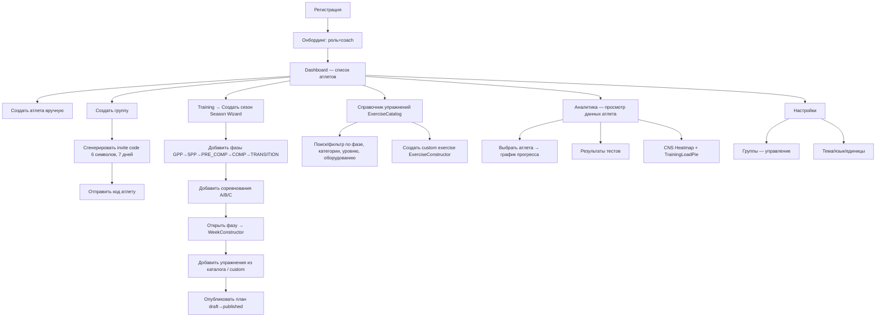

# Анализ Coach Flows — Энциклопедия Прыгуна v2

> [CS] Глубокий архитектурный анализ по запросу: все флоу тренера, логика групп, упражнений, индивидуальных планов, найденные затыки и пробелы.

---

## 1. Схема текущих флоу тренера (Coach)



---

## 2. Детальный разбор каждого флоу

### 2.1 Создание группы
**Путь:** Settings → Groups → Create

| Шаг | Реализация | Статус |
|-----|-----------|--------|
| Тренер нажимает "+" | `GroupsPage` → `setShowCreate(true)` | ✅ Работает |
| Вводит имя группы | `createGroup(name, timezone='UTC')` | ✅ |
| Генерирует invite code | `generateInviteCode(groupId)` → 6 символов, 7 дней | ✅ |
| Копирует код | `navigator.clipboard.writeText(code)` | ✅ |
| Атлет вводит код | `joinByInviteCode(code)` → создаёт `group_members` запись | ✅ |

> [!WARNING]
> **Затык #1:** Тренер **не видит** список участников группы. В UI нет отображения `group_members` для конкретной группы — только название группы и invite code. Тренер не знает, кто присоединился.

> [!WARNING]
> **Затык #2:** Нет возможности **удалить/переименовать группу** и **удалить участника** из группы. Только создание + генерация кода.

> [!WARNING]
> **Затык #3:** Атлет при `joinByInviteCode` вызывает `getSelfAthleteId()` — но это ищет запись в `athletes`, где `coach_id = user.id`. У атлета, который регистрируется самостоятельно, **нет записи в `athletes`** — он не был создан тренером. Это фундаментальная проблема: **самостоятельно зарегистрированные атлеты не могут присоединиться к группе**.

---

### 2.2 Добавление упражнений в план

**Путь:** Training → Season → Phase → Week → WeekConstructor → ExercisePicker

| Шаг | Реализация | Статус |
|-----|-----------|--------|
| Выбрать сезон | Список сезонов + `setSelectedSeasonId` | ✅ |
| Выбрать фазу | `SeasonDetail` → `listPhases(seasonId)` | ✅ |
| Создать/открыть недельный план | `getOrCreatePlan(phaseId, weekNumber)` | ✅ |
| Добавить упражнение | `addExerciseToPlan(...)` из ExercisePicker | ✅ |
| Установить sets/reps/intensity | `updatePlanExercise(id, data)` | ✅ |
| Перемещать упражнения между днями | `reorderExercises(...)` | ✅ |
| CNS мониторинг | `calculateWeeklyCNS(exercises)` → green/yellow/red | ✅ |
| Опубликовать | `publishPlan(planId)` → snapshot + status=published | ✅ |

> [!IMPORTANT]
> **Затык #4:** `training_plans` **не привязан к конкретному атлету или группе!** Поле `phase_id` → `season_id` → `coach_id`. В типах `TrainingPlansRecord` нет `athlete_id` и `group_id`. Документация (`PERIODIZATION.md` line 28) упоминает `group_id` в `training_plans`, но в реальных типах (`types.ts` line 96-101) его **нет**. Это означает:
> - Тренер создаёт план, но не может **назначить** его конкретному атлету или группе
> - Атлет видит план через `getPublishedPlanForToday` — но как он знает, **какой** план его?

---

### 2.3 Назначение индивидуальных планов

**Текущее состояние:** ⚠️ **Частично реализовано, есть критический пробел**

| Аспект | Анализ |
|--------|--------|
| **`seasons.athlete_id`** | Поле существует в типах (`SeasonsRecord.athlete_id?: string`) и в `listSeasons(athleteId)` фильтр работает | 
| **`createSeason`** | Принимает `athlete_id` — сезон можно привязать к атлету | 
| **`training_plans` → атлет** | ❌ Нет прямой связи. План привязан к фазе, фаза к сезону, сезон к атлету. Цепочка существует, **но UI это не показывает** |
| **Фильтр по атлету** | `filterAthleteId` в `training/page.tsx` — передаётся в `listSeasons(athleteId)`. Работает ✅ |
| **`training_plans.group_id`** | ❌ НЕ СУЩЕСТВУЕТ. Упоминается в `PERIODIZATION.md`, но не в `types.ts` |

> [!CAUTION]
> **Затык #5 (КРИТИЧЕСКИЙ):** Система периодизации **not connected to groups**. Если у тренера 3 группы (юниоры, сеньоры, элита), он **не может** создать один план для всей группы. Каждый атлет требует отдельного сезона → фаз → планов. При 20 атлетах это 20× дублирование работы.

---

### 2.4 Флоу создания custom exercises

**Путь:** Reference → Exercises → Exercise Constructor

| Шаг | Реализация | Статус |
|-----|-----------|--------|
| Создать упражнение | `createCustomExercise(coachId, data)` | ✅ |
| Visibility = personal | По умолчанию | ✅ |
| Отправить на модерацию | `submitForReview(id)` → pending_review | ✅ (сервис) |
| Admin approve/reject | ❌ **Нет UI** — в backlog на Track 6 | ❌ |
| Approved → видно всем | `listApprovedCommunityExercises()` | ✅ (сервис) |

> [!NOTE]
> **Затык #6:** `customExercises.ts:61` использует фильтр `deleted = false`, но тип `CustomExercisesRecord` наследует `SoftDeletable` с полем `deleted_at?: string`, а не `deleted: boolean`. **Несоответствие** — soft-delete в custom exercises может не работать.

---

## 3. Карта проблем и затыков

### 🔴 Критические (блокируют usability)

| # | Проблема | Влияние |
|---|---------|---------|
| **C1** | **План не привязывается к группе** — нет `group_id` в `training_plans` | Тренер не может раздать один план нескольким атлетам. 20 атлетов = 20 копий плана |
| **C2** | **Самостоятельный атлет не может вступить в группу** — `getSelfAthleteId()` ищет `athletes.coach_id=user.id`, у самостоятельного атлета нет записи | Invite code система не работает для "пришёл атлет → ввёл код → попал к тренеру" |
| **C3** | **Нет связи plan → athlete для просмотра** — `getPublishedPlanForToday` в `trainingLogs.ts` ищет план, но непонятно, как атлет находит **свой** план среди опубликованных | Атлет может не видеть никакого плана или видеть чужой |

### 🟡 Средние (ухудшают UX, но можно обойти)

| # | Проблема | Влияние |
|---|---------|---------|
| **M1** | **Тренер не видит участников группы** — UI показывает только имя группы + invite code | Тренер не знает, кто в какой группе |
| **M2** | **Нет удаления/редактирования группы** — только создание | Coach stuck with typo in group name |
| **M3** | **`seasons.athlete_id` — дублирование** — если сезон уже привязан к тренеру через `coach_id`, зачем отдельный `athlete_id`? | Непонятно, это для individual plan или для athlete-owned season? |
| **M4** | **Auto-Fill не работает реально** — сервис `adaptation.ts` существует, но нигде не вызывается client-side automatically при readiness < 60 | Фича описана в PERIODIZATION.md, но не реализована |
| **M5** | **QuickPlanBuilder** сохраняет в localStorage, не в PocketBase — потеряется при очистке | Plans not synced/backed up |
| **M6** | **Нет роли "assistant coach"** — только coach/athlete/admin | Помощник тренера не может создавать планы |

### 🟢 Минорные (косметика / low priority)

| # | Проблема |
|---|---------|
| **L1** | `PHASE_COLORS` в `seasons.ts` использует hardcoded hex вместо CSS tokens |
| **L2** | `customExercises.ts` `deleted = false` vs `deleted_at = ""` — несоответствие soft-delete конвенции |
| **L3** | `training/page.tsx:147` — опция "myself" (`self`) в фильтре атлетов для тренера: зачем тренеру создавать план "для себя"? |
| **L4** | `hardDeleteAthleteWithData` удаляет seasons с `athlete_id = athleteId`, но seasons имеют `coach_id`, не `athlete_id` — cascade может не удалить сезоны |

---

## 4. Архитектурная схема: что забыли

### 4.1 Нет "назначения плана"
```
ТЕКУЩАЯ АРХИТЕКТУРА:
Season → Phase → Plan → Exercises
   ↑                         
   coach_id                  

НУЖНАЯ АРХИТЕКТУРА:
Season → Phase → Plan → Exercises
   ↑                ↓
   coach_id     PlanAssignments
                    ↓
              athlete_id / group_id
```

**Предложение:** Новая коллекция `plan_assignments`:
| Field | Type | Note |
|-------|------|------|
| plan_id | FK → training_plans | Какой план |
| athlete_id | FK → athletes | Кому (конкретный атлет) |
| group_id | FK → groups | Или целой группе |
| assigned_at | date | Когда назначен |
| status | enum | active / completed / cancelled |

### 4.2 Нет "athlete profile" в связке с user
```
ТЕКУЩАЯ ПРОБЛЕМА:
User (role=athlete) ←❌→ Athletes (coach_id = кто создал)

Самостоятельный атлет:
- Регистрируется → User record (role=athlete)
- НЕТ athletes record
- НЕ МОЖЕТ: joinByInviteCode, logExercise, viewDashboard (всё завязано на athletes.id)
```

**Предложение:** При регистрации с role=athlete **автоматически** создавать запись в `athletes` с `user_id = user.id` и `coach_id = null` (ещё нет тренера). При `joinByInviteCode` → обновлять `coach_id` записи.

### 4.3 Нет копирования/шаблонов планов
Тренер создаёт идеальный GPP-план → хочет назначить его 10 атлетам с небольшими корректировками. **Нет функции:**
- Дублировать план
- Создать шаблон из плана
- Массово назначить план группе

### 4.4 Нет истории версий плана (для атлета)
`plan_snapshots` существует, но UI для просмотра истории версий — только `PlanHistoryModal`. Атлет не может видеть, что было изменено.

---

## 5. Логика системы — что работает хорошо ✅

| Аспект | Оценка |
|--------|--------|
| **Периодизация** Season→Phase→Plan→Exercise | Чёткая иерархия, валидация фаз |
| **CNS мониторинг** | Работает в WeekConstructor |
| **Readiness система** | Чекин → score → Auto-Adaptation (задокументировано, частично реализовано) |
| **Peaking warnings** | Валидация соревнований vs фаз |
| **Invite codes** | 6-char, 7-day expiry, защита от injection |
| **Soft delete** | Единообразный `deleted_at` pattern |
| **Exercise catalog** | 68+ упражнений, мультиязычные, фильтры |
| **Gamification** | 13 типов ачивок, стрики, celebrations |
| **Данные** | Все 21 PB коллекция определены, типизированы в TypeScript |

---

## 6. Рекомендованный порядок исправлений

| Приоритет | Задача | Сложность |
|-----------|--------|-----------|
| 1 | Автоматическое создание `athletes` record при регистрации role=athlete | Средняя |
| 2 | Добавить `plan_assignments` коллекцию (plan → athlete/group) | Высокая |
| 3 | UI: список участников группы + удаление/редактирование группы | Средняя |
| 4 | Исправить `customExercises.ts` soft-delete (`deleted=false` → `deleted_at=""`) | Низкая |
| 5 | Функция "дублировать план" / "назначить план группе" | Высокая |
| 6 | Убрать опцию "myself" из athlete filter в training page | Низкая |

---

## 7. Доклад switch-agent

```
[CS] 🟡 Текущий статус: Track 4.13 — QA Mobile Bug Fixes (Next)

✅ Готово: Tracks 1-4.12 (все закрыты)

🆕 Последние изменения (CHANGELOG):
- Track 4.12: Audit Bug Fixes — readiness calc, self-athlete removal, role guards
- Track 4.11: Debt Closure — inline styles → CSS, RU strings → i18n, PWA icons
- Track 4.9 Phase 5: Dashboard Polish + ErrorBoundary

📐 План от предыдущего агента: ❌ Нет (track 4.13 не начат)
📝 Walkthrough предыдущей работы: ❌ Нет

🎯 Текущая задача: Архитектурный анализ coach flows (research-only)

🛠 Скиллы: architecture, architect-review, database-architect, brainstorming
```
