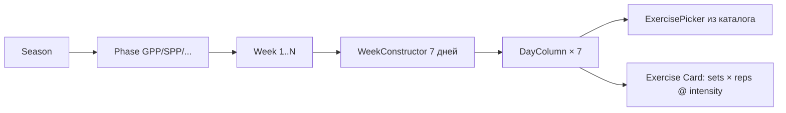

# Глубокий анализ Training UX — Создание/Редактирование тренировок

> Дополнение к [coach_flows_analysis.md](file:///Users/bogdan/.gemini/antigravity/brain/f7927f0e-72ae-4ba0-8558-ad770189414c/coach_flows_analysis.md)

---

## 1. Что УЖЕ реализовано ✅

### 1.1 Coach: Создание и редактирование тренировки



| Возможность | Компонент | Статус |
|------------|-----------|--------|
| Навигация по неделям | `WeekConstructor` → prev/next | ✅ |
| Добавить упражнение из каталога | `ExercisePicker` (library + custom) | ✅ |
| Задать sets/reps/intensity | `DayColumn` → `ExerciseCard` inline edit | ✅ Но **только строки** |
| Перемещать вверх/вниз | `onReorder` | ✅ |
| Удалить упражнение | `removePlanExercise` | ✅ |
| Auto-Fill по фазе | `autoFillWeek()` | ✅ |
| CNS мониторинг | `calculateWeeklyCNS` → green/yellow/red | ✅ |
| Publish/Revert | `publishPlan` / `revertToDraft` | ✅ |
| Snapshot версии | `createSnapshot` → `PlanHistoryModal` | ✅ |
| Print/PDF export | `window.print()` + `generatePDF` | ✅ |
| Multi-week overview | `MultiWeekView` | ✅ |

### 1.2 Coach: Логирование результатов (через WeekConstructor)

| Возможность | Компонент | Статус |
|------------|-----------|--------|
| Кнопка "Record" на каждом дне | `DayColumn` → `onLogResult` | ✅ |
| Модальное окно с логом | `TrainingLog.tsx` (552 строк) | ✅ **Богатый** |
| **4 типа ввода по unit_type:** | | |
| — `reps` (bodyweight) | # → reps | ✅ |
| — `weight` (штанга) | # → reps × kg | ✅ |
| — `time` (секунды) | # → duration (sec) | ✅ |
| — `distance` (метры) | # → distance (m) | ✅ |
| Добавить/удалить подход | +/- кнопки | ✅ |
| RPE на каждое упражнение | Slider 1-10 | ✅ |
| Batch save | `batchSaveLogExercises` (logs.ts) | ✅ |
| Readiness badge в заголовке | Если score передан | ✅ |

### 1.3 Athlete: Просмотр плана + логирование

| Возможность | Компонент | Статус |
|------------|-----------|--------|
| Показать упражнения на сегодня | `AthleteTrainingView` → `todayExercises` | ✅ |
| Автосоздание draft лога | `createTrainingLog` | ✅ |
| Ввод данных | `ExerciseItem` → sets stepper + RPE | ⚠️ **Упрощённый** |
| Save per exercise | `createLogExercise` / `updateLogExercise` | ✅ |

---

## 2. Критические пробелы 🔴

### 2.1 Две параллельные системы логирования

> [!CAUTION]
> В проекте существуют **ДВА отдельных сервиса** для логирования тренировок:

| Сервис | Файл | Используется в |
|--------|------|---------------|
| **Rich API** | [logs.ts](file:///Users/bogdan/antigravity/skills%20master/tf/src/lib/pocketbase/services/logs.ts) | `TrainingLog.tsx` (coach) |
| **Simple API** | [trainingLogs.ts](file:///Users/bogdan/antigravity/skills%20master/tf/src/lib/pocketbase/services/trainingLogs.ts) | `AthleteTrainingView.tsx` |

**Разница:**
- `logs.ts` → `batchSaveLogExercises` с полным `SetData[]` JSON (reps, weight, time, distance)
- `trainingLogs.ts` → `createLogExercise` с только `sets_completed: number` и `rpe: number`

**Проблема:** Атлет через `AthleteTrainingView` логирует **только количество подходов + RPE**, без указания конкретных повторений, весов, дистанций. Coach через `TrainingLog` видит богатые данные. Данные **не совместимы** — атлет и тренер пишут в разные поля.

### 2.2 Coach не видит unit_type при планировании

В `DayColumn.tsx` (ExerciseCard) тренер видит:
```
Sets × Reps @ Intensity%
```

Это **одинаково для всех типов** упражнений. Тренер не может:
- Для штанги указать конкретный вес: `4×8 @ 80kg`
- Для спринта указать дистанцию: `6×30m`
- Для планки указать время: `3×60s`

Поле `intensity` — просто строка (`%`), а не типизированное значение.

> [!IMPORTANT]
> Вывод: `plan_exercises` хранит `sets: number`, `reps: string`, `intensity: string`. Это **не различает** типы упражнений. Нужно либо:
> - Расширить модель `plan_exercises` полями `weight`, `duration`, `distance`
> - Либо использовать JSON-поле `planned_sets_data` аналогично `sets_data` в логах

### 2.3 Нет индивидуальной корректировки плана

```
ТЕКУЩИЙ ПОТОК:
Coach создаёт план → публикует → ВСЕ атлеты сезона видят ОДИНАКОВЫЙ план

НУЖНЫЙ ПОТОК:
Coach создаёт общий план → публикует →
  → Для Петрова: 4×10 @ 80kg (продвинутый)
  → Для Иванова: 3×10 @ 60kg (начинающий)
  → Для Сидоровой: 4×8 @ 70kg (восстановление после травмы)
```

Сейчас **нет механизма** для:
- Копирования общего плана и адаптации под конкретного атлета
- Переопределения sets/reps/intensity отдельного упражнения для конкретного атлета
- «Исключения» упражнения из плана для конкретного атлета (напр., травма)

### 2.4 Атлет не видит другие дни недели

`AthleteTrainingView` показывает **только сегодняшний день** (`todayIdx`). Атлет не может:
- Посмотреть, что было вчера (и что он пропустил)
- Заглянуть вперёд на завтра
- Просмотреть всю неделю как обзор

### 2.5 Нет height-specific input (прыжки)

Хотя `PERIODIZATION.md` определяет тип `height`:
```typescript
{ type: 'height'; attempts: { height: number; result: 'made'|'miss' }[] }
```

В реальном коде `TrainingLog.tsx`:
- `HeightAttempt` интерфейс **определён** (строка 34-37), но **НЕ используется** в UI
- UI обрабатывает только `reps`, `weight`, `time`, `distance`
- Нет отображения попыток с высотами (сделал/не сделал)

Для прыжков в высоту это критически важная фича!

---

### 2.6 Нет поддержки нескольких тренировок в день

> [!CAUTION]
> Стандартная практика в прыжках в высоту — **двухразовые тренировки** (AM/PM), особенно в SPP и PRE_COMP фазах. Текущая архитектура это **не поддерживает**.

**Текущее ограничение:**
- `plan_exercises.day_of_week` — **один плоский список** на день, нет деления на сессии
- `training_logs` — привязан к `athlete_id + plan_id + date` (UNIQUE) — **один лог на день**
- `DayColumn.tsx` рендерит все упражнения дня одним списком
- `AthleteTrainingView` показывает все упражнения дня без группировки

**Что хочет тренер:**
```
Понедельник:
  🌅 УТРО (силовая):
  ├── Присед 4×8 @ 80kg
  ├── Тяга 3×5 @ 100kg
  └── Жим лёжа 3×10
  
  🌆 ВЕЧЕР (скоростно-прыжковая):
  ├── Спринт 6×30m
  ├── Прыжки в глубину 5×3
  └── Approach runs 4×full
```

**Решение:** добавить `session: number` (0=AM, 1=PM, 2=extra) или `session_label: string` в `plan_exercises`. В `DayColumn` группировать по session. В `training_logs` поменять constraint на `athlete_id + plan_id + date + session`.

---

## 3. Средние пробелы 🟡

### 3.1 Нет учёта времени отдыха между подходами
Многие тренеры планируют: `4×8 @ 80kg, отдых 2мин`. Нет поля `rest_seconds`.

### 3.2 QuickPlanBuilder → localStorage only
Отдельная тренировка через `QuickPlanBuilder` сохраняется **только в localStorage** — не в PocketBase. Если тренер создаёт "быструю тренировку" на сборах, она потеряется.

### 3.3 Нет "заметок тренера" к конкретному упражнению для атлета
Поле `notes` в `plan_exercises` есть, но не отображается атлету в `AthleteTrainingView`.

### 3.4 Нет комментариев/фидбека от тренера к логу атлета
Тренер может видеть логи (`getLogsForPlan`), но не может оставить комментарий к тренировке атлета.

### 3.5 Нет "tempo" (темп выполнения)
Для силовых: `4×8 @ 80kg, темп 3-1-1-0`. Это стандартная нотация (eccentric-pause-concentric-pause).

---

## 4. Матрица "что внедрено vs что нужно"

| Фича | Спроектировано | Реализовано | UI работает |
|------|:-----------:|:---------:|:-----------:|
| Season → Phase → Plan hierarchy | ✅ | ✅ | ✅ |
| 7-дневная сетка (WeekConstructor) | ✅ | ✅ | ✅ |
| Exercise Picker (каталог) | ✅ | ✅ | ✅ |
| Custom exercises | ✅ | ✅ | ✅ |
| Sets/Reps/Intensity на плане | ✅ | ✅ | ⚠️ text-only |
| Auto-Fill по фазе | ✅ | ✅ | ✅ |
| CNS мониторинг | ✅ | ✅ | ✅ |
| Publish/Draft lifecycle | ✅ | ✅ | ✅ |
| Snapshots/History | ✅ | ✅ | ✅ |
| **Rich logging (4 unit types)** | ✅ | ✅ | ✅ coach, ❌ athlete |
| **Height attempts** | ✅ типы | ❌ | ❌ |
| **Athlete: вся неделя** | ❌ | ❌ | ❌ |
| **Несколько тренировок/день** | ❌ | ❌ | ❌ |
| **Individual plan overrides** | ❌ | ❌ | ❌ |
| **Plan → group assignment** | ❌ | ❌ | ❌ |
| **Coach → athlete feedback** | ❌ | ❌ | ❌ |
| **Unit-type-aware plan editing** | ❌ | ❌ | ❌ |
| **Auto-Adaptation live** | ✅ | ⚠️ partial | ❌ |
| Rest between sets | ❌ | ❌ | ❌ |
| Tempo notation | ❌ | ❌ | ❌ |

---

## 5. Рекомендации по приоритету

### P0 (Must-have для рабочего MVP)

1. **Множественные сессии в день** — поле `session` в `plan_exercises` + UI группировка AM/PM в `DayColumn` и `AthleteTrainingView`
2. **Унифицировать logging** — атлет должен использовать тот же `SetsInput` (из TrainingLog.tsx) с 4 типами ввода, вместо упрощённого stepper
3. **Добавить height attempts** — для прыжков в высоту это core feature
4. **Показать атлету всю неделю** — не только сегодня, но и другие дни (с пометкой «сегодня»)

### P1 (Важно для usability)

5. **Unit-type-aware plan editing** — тренер при планировании видит адаптированный UI: для штанги — sets×reps×weight, для спринта — sets×distance
6. **Individual plan overrides** — overlay поверх общего плана с корректировками для конкретного атлета
7. **Notes видны атлету** — поле `notes` из `plan_exercises` отображается в AthleteTrainingView

### P2 (Nice to have)

8. Комментарии тренера к логам атлета
9. Rest time поле
10. Tempo нотация
11. QuickPlanBuilder → PocketBase sync
