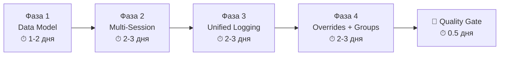

# Track 4.14: Training System Overhaul — Финальный план исполнения

> **Обновлённый план** с учётом ревью, скиллами для каждого этапа, и порядком работы.  
> Gate: [gate.md](file:///Users/bogdan/antigravity/skills%20master/tf/conductor/tracks/track-4.14-training-overhaul/gate.md) (118 строк, ~56 чекбоксов)

---

## Структура плана



---

## Фаза 1: Data Model — PocketBase Schema + TypeScript Types

| Параметр | Значение |
|----------|----------|
| **Сложность** | 🟢 Низкая |
| **Риск** | 🟢 Низкий — все поля optional, defaults сохраняют совместимость |
| **Пунктов в gate** | 16 |
| **Точка остановки** | `pnpm type-check && pnpm build` — exit 0 |

### Скиллы для агента-исполнителя

| Скилл | Зачем |
|-------|-------|
| `always` → `concise-planning`, `lint-and-validate`, `jumpedia-design-system`, `verification-before-completion` | Стандартный набор |
| `architecture` → `database-architect` | Проектирование `plan_assignments`, indexes, cascade |
| `typescript` → `typescript-expert` | Расширение types.ts, Zod schema |

### Порядок работы

1. **PB Admin** (API или browser_subagent → `https://jumpedia.app/_/`):
   - Добавить 5 полей в `plan_exercises` (session, weight, duration, distance, rest_seconds)
   - Добавить 2 поля в `training_plans` (athlete_id, parent_plan_id)
   - Добавить session в `training_logs`
   - Проверить `athletes.user_id` (может уже существовать)
   - Создать коллекцию `plan_assignments` + API rules
   - Обновить UNIQUE index `training_logs` → включить `session`
   - Настроить cascade delete для `plan_assignments`

2. **TypeScript** — [types.ts](file:///Users/bogdan/antigravity/skills%20master/tf/src/lib/pocketbase/types.ts):
   - `PlanExercisesRecord` += session, weight, duration, distance, rest_seconds
   - `TrainingPlansRecord` += athlete_id, parent_plan_id
   - `TrainingLogsRecord` += session
   - `SetData` += height, result
   - Добавить `PlanAssignmentsRecord`

3. **Collections** — [collections.ts](file:///Users/bogdan/antigravity/skills%20master/tf/src/lib/pocketbase/collections.ts):
   - Добавить `PLAN_ASSIGNMENTS`

4. **Zod Validation** — `src/lib/validation/planAssignments.ts`:
   - Schema для PlanAssignmentsRecord

5. **Verify:** `pnpm type-check && pnpm build`

---

## Фаза 2: Multi-Session (AM/PM) + Unit-Aware Plan Editing

| Параметр | Значение |
|----------|----------|
| **Сложность** | 🟡 Средняя |
| **Риск** | 🟡 Средний — много UI изменений в DayColumn & WeekConstructor |
| **Пунктов в gate** | 14 |
| **Точка остановки** | `pnpm type-check && pnpm build` + browser test AM/PM |

### Скиллы для агента-исполнителя

| Скилл | Зачем |
|-------|-------|
| `always` | Стандартный набор |
| `frontend` → `react-best-practices`, `nextjs-app-router-patterns` | Компоненты DayColumn, WeekConstructor |
| `ui_design` → `react-ui-patterns` | ExerciseCard adapt по unit_type |
| `i18n` → `i18n-localization` | ~8 новых ключей × 3 локали |

> [!IMPORTANT]
> **mandatory_reads:** `docs/DESIGN_SYSTEM.md` + `src/styles/tokens.css` перед UI работой!

### Порядок работы

1. **Services** — [plans.ts](file:///Users/bogdan/antigravity/skills%20master/tf/src/lib/pocketbase/services/plans.ts):
   - `addExerciseToPlan` += `session?: number`
   - `updatePlanExercise` += weight, duration, distance, rest_seconds
   - Новая `groupByDayAndSession()` → `Record<number, Record<number, PlanExerciseWithExpand[]>>`

2. **UI** — [DayColumn.tsx](file:///Users/bogdan/antigravity/skills%20master/tf/src/components/training/DayColumn.tsx):
   - Группировка по session (AM/PM headers)
   - Кнопка "+ Add Session"
   - `ExerciseCard` — адаптивные поля по `unit_type` (expand → exercise_id.unit_type)

3. **UI** — [WeekConstructor.tsx](file:///Users/bogdan/antigravity/skills%20master/tf/src/components/training/WeekConstructor.tsx):
   - `handleAddExercise` передаёт `session`
   - CNS per-session + суммарно

4. **i18n** — `messages/{en,ru,cn}/common.json`:
   - `training.sessionAM`, `training.sessionPM`, `training.addSession`, etc.

5. **Verify:** `pnpm type-check && pnpm build` + визуальный тест в браузере

---

## Фаза 3: Unified Athlete Logging + Height Attempts + Week View

| Параметр | Значение |
|----------|----------|
| **Сложность** | 🔴 Высокая |
| **Риск** | 🔴 Высокий — удаление файла, рефактор крупного компонента, авто-создание athletes |
| **Пунктов в gate** | 16 |
| **Точка остановки** | `pnpm type-check && pnpm build` + athlete week view test |

### Скиллы для агента-исполнителя

| Скилл | Зачем |
|-------|-------|
| `always` | Стандартный набор |
| `refactoring` → `code-refactoring-refactor-clean` | Рефактор trainingLogs → logs, удаление файла |
| `frontend` → `react-best-practices` | AthleteTrainingView major refactor |
| `ui_design` → `react-ui-patterns` | Height attempts UI, 7-day week view |
| `i18n` → `i18n-localization` | ~10 новых ключей |

> [!WARNING]
> **Самая рискованная фаза!** Рекомендации:
> - Сначала мигрировать inline-типы из `trainingLogs.ts` → `types.ts`
> - Затем перенести функции в `logs.ts` по одной
> - Только после — удалить `trainingLogs.ts` и обновить импорты
> - Авто-создание athletes record — тестировать отдельно от UI-рефактора

### Порядок работы

1. **Type Migration** — inline types из [trainingLogs.ts](file:///Users/bogdan/antigravity/skills%20master/tf/src/lib/pocketbase/services/trainingLogs.ts):
   - `TrainingLogRecord` → merge с `TrainingLogsRecord` в `types.ts` (добавить `duration_min`, `rpe`, `status`)
   - `LogExerciseRecord` → merge с `LogExercisesRecord` (добавить `plan_exercise_id`, `sets_completed`)

2. **Services** — [logs.ts](file:///Users/bogdan/antigravity/skills%20master/tf/src/lib/pocketbase/services/logs.ts):
   - `getOrCreateLog` += `session?: number`
   - Перенести `getPublishedPlanForToday` из trainingLogs.ts
   - Новая `listWeekLogs(athleteId, weekStartDate)`

3. **Delete** — `trainingLogs.ts`:
   - `grep -r "trainingLogs" src/` → обновить все импорты
   - Удалить файл

4. **Auth fix** — авто-создание athletes record:
   - [auth.ts](file:///Users/bogdan/antigravity/skills%20master/tf/src/lib/pocketbase/services/auth.ts) / [OnboardingWizard.tsx](file:///Users/bogdan/antigravity/skills%20master/tf/src/components/onboarding/OnboardingWizard.tsx)
   - При `role=athlete` → `createAthlete({ name, user_id: user.id, coach_id: '' })`

5. **UI** — [AthleteTrainingView.tsx](file:///Users/bogdan/antigravity/skills%20master/tf/src/components/training/AthleteTrainingView.tsx):
   - 7-дневный виев (scroll + highlight today)
   - Группировка по session
   - Rich SetsInput вместо stepper

6. **UI** — [TrainingLog.tsx](file:///Users/bogdan/antigravity/skills%20master/tf/src/components/training/TrainingLog.tsx):
   - Height attempts UI (height + made/miss)
   - Session prop

7. **i18n** + **Verify**

---

## Фаза 4: Individual Plan Overrides + Group Assignment + Coach Notes

| Параметр | Значение |
|----------|----------|
| **Сложность** | 🟡 Средняя |
| **Риск** | 🟡 Средний — но зависит от Фазы 3 (athletes record для self-registered) |
| **Пунктов в gate** | 14 |
| **Точка остановки** | `pnpm type-check && pnpm build` + group assignment browser test |

### Скиллы для агента-исполнителя

| Скилл | Зачем |
|-------|-------|
| `always` | Стандартный набор |
| `architecture` → `architect-review` | Дизайн plan_assignments service |
| `frontend` → `react-best-practices`, `core-components` | GroupsPage, SeasonDetail UI |
| `ui_design` → `react-ui-patterns` | Assign modal, override flow |
| `i18n` → `i18n-localization` | ~10+ ключей |

### Порядок работы

1. **NEW** — `src/lib/pocketbase/services/planAssignments.ts`:
   - `assignPlanToAthlete`, `assignPlanToGroup`
   - `getAssignmentsForPlan`, `getAssignedPlanForAthlete`
   - `unassignPlan`

2. **Services** — `plans.ts`:
   - `duplicatePlan()` — deep copy plan + exercises
   - `createIndividualOverride()` — copy + set parent_plan_id + athlete_id

3. **Services** — `groups.ts`:
   - `listGroupMembers()`, `removeGroupMember()`
   - `updateGroup()`, `deleteGroup()`

4. **UI** — `SeasonDetail.tsx`:
   - "Assigned to" badge
   - "Assign" button → modal (select athlete/group)
   - "Customize for..." → individual override

5. **UI** — Groups page:
   - Member list, edit/delete group, remove member

6. **UI** — `AthleteTrainingView.tsx`:
   - Показывать `notes` тренера

7. **Docs** — `ARCHITECTURE.md` → добавить `plan_assignments`

8. **i18n** + **Verify**

---

## 🏁 Quality Gate — Финальная проверка

```bash
pnpm type-check && pnpm build && pnpm test && pnpm lint
```

| Тест | Метод |
|------|-------|
| Coach creates AM/PM sessions | Browser test |
| Athlete sees 7-day week view + rich input | Browser test |
| Assign plan to group → members see it | Browser test |
| Height jump attempts work | Browser test |
| **Self-registered athlete joins via invite** | Browser test (✅ новый!) |
| CHANGELOG.md updated | Manual check |

---

## Сводная таблица скиллов по фазам

| Фаза | always | architecture | typescript | frontend | ui_design | refactoring | i18n |
|------|:------:|:----------:|:----------:|:--------:|:---------:|:-----------:|:----:|
| 1 | ✅ | `database-architect` | `typescript-expert` | — | — | — | — |
| 2 | ✅ | — | — | `react-best-practices`, `nextjs-app-router-patterns` | `react-ui-patterns` | — | `i18n-localization` |
| 3 | ✅ | — | — | `react-best-practices` | `react-ui-patterns` | `code-refactoring` | `i18n-localization` |
| 4 | ✅ | `architect-review` | — | `react-best-practices`, `core-components` | `react-ui-patterns` | — | `i18n-localization` |

> [!TIP]
> **Для каждой фазы:** первым делом запустить `/auto-skills` с этими группами + обязательно `mandatory_reads` для UI-фаз (2, 3, 4).
