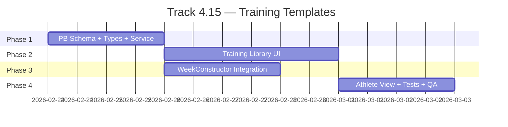

# Track 4.15: Training Templates — Детальный План Исполнения

> **Зависимость:** Track 4.14 (Training System Overhaul) — ✅ Done
>
> **Цель:** Единая система шаблонов (разминки + тренировочные дни) с stamp-in-plan, ad-hoc warmup, drag-and-drop, и collapsible athlete view.

---

## Обзор фаз

---

## Фаза 1: PB Schema + Types + Service (1-2 дня)

### 🛠 Обязательные скиллы

| Группа | Скиллы | Зачем |
|--------|--------|-------|
| `always` | `concise-planning`, `lint-and-validate`, `jumpedia-design-system`, `verification-before-completion` | Стандарт |
| `architecture` | `architecture`, `database-architect` | Дизайн коллекций, индексы, API Rules |
| `typescript` | `typescript-expert` | Типизация, branded types, Zod schemas |

### 📋 Чеклист

#### PB Admin: Новые коллекции
- [ ] Создать `training_templates` коллекцию (coach_id, name_ru/en/cn, type, total_minutes, is_system, description_ru/en/cn)
- [ ] Создать `template_items` коллекцию (template_id, order, block, exercise_id, custom_text_ru/en/cn, duration_seconds, sets, reps, intensity, weight, distance, rest_seconds, notes)
- [ ] API Rules: training_templates (coach_id || is_system для list/view; auth для CUD)
- [ ] API Rules: template_items (auth для всех операций)
- [ ] Индексы: `idx_templates_coach`, `idx_items_template`

#### PB Admin: Модификация plan_exercises
- [ ] Добавить `block` (Select: warmup/main, default 'main')
- [ ] Сделать `exercise_id` nullable
- [ ] Добавить `custom_text_ru`, `custom_text_en`, `custom_text_cn` (Text, nullable)
- [ ] Добавить `source_template_id` (Relation→training_templates, nullable)
- [ ] Индекс: `idx_planex_block` (plan_id, day_of_week, session, block)

#### Seed Data
- [ ] 3 системных warmup-шаблона (Training 15м, Competition 25м, Recovery 20м) — из текущего hardcoded data в [warmup/page.tsx](file:///Users/bogdan/antigravity/skills%20master/tf/src/app/%5Blocale%5D/%28protected%29/reference/warmup/page.tsx#L12-L45)
- [ ] 3 системных day-шаблона (Jump Day, Strength Day, Speed Day) — на основе фаз из [PERIODIZATION.md](file:///Users/bogdan/antigravity/skills%20master/tf/docs/PERIODIZATION.md)

#### TypeScript Types
- [ ] `types.ts` — `TrainingTemplateRecord` interface
- [ ] `types.ts` — `TemplateItemRecord` interface
- [ ] `types.ts` — `PlanExercisesRecord` обновить (block, nullable exercise_id, custom_text_*, source_template_id)
- [ ] `collections.ts` — `TRAINING_TEMPLATES`, `TEMPLATE_ITEMS`
- [ ] `validation/templates.ts` — Zod: `templateSchema`, `templateItemSchema`

#### Service
- [ ] **NEW** `lib/pocketbase/services/templates.ts`:
  - `listTemplates(coachId)` — все шаблоны (свои + системные)
  - `getTemplate(id)` — с expand template_items.exercise_id
  - `createTemplate(data)` — создание
  - `updateTemplate(id, data)` — обновление
  - `deleteTemplate(id)` — удаление (проверка is_system)
  - `copyTemplate(id, coachId)` — копирование системного
  - `stampTemplate(templateId, planId, dayOfWeek, session)` — injection в plan_exercises
  - `ejectTemplate(planId, dayOfWeek, session)` — удаление warmup block items
  - `addWarmupItem(planId, day, session, data)` — ad-hoc добавление
  - Template Item CRUD: `addItem`, `updateItem`, `removeItem`, `reorderItems`

#### Verification
- [ ] `pnpm type-check` — exit 0
- [ ] `pnpm build` — exit 0

---

## Фаза 2: Training Library UI (2-3 дня)

### 🛠 Обязательные скиллы

| Группа | Скиллы | Зачем |
|--------|--------|-------|
| `always` | `concise-planning`, `lint-and-validate`, `jumpedia-design-system`, `verification-before-completion` | Стандарт |
| `frontend` | `nextjs-app-router-patterns`, `react-best-practices`, `core-components` | Компоненты, Next.js patterns |
| `ui_design` | `react-ui-patterns`, `ui-visual-validator` | UX patterns, visual compliance |
| `i18n` | `i18n-localization` | 3 локали |

**mandatory_reads:** `docs/DESIGN_SYSTEM.md`, `src/styles/tokens.css`

### 📋 Чеклист

#### Рефакторинг страницы
- [ ] Перенести `reference/warmup/` → `reference/templates/` (или добавить новую страницу, сохраняя warmup для совместимости)
- [ ] Декомпозировать на компоненты: `TemplateList`, `TemplateEditor`, `TemplateItemRow`

#### TemplateList
- [ ] Табы: [🔥 Разминки] / [🏋️ Дни тренировок]
- [ ] Секция «Системные» (is_system=true, read-only)
- [ ] Секция «Мои» (coach_id=currentUser)
- [ ] Кнопка [📋 Копировать] на системных → `copyTemplate()`
- [ ] Кнопки [✏️ Ред.] [🗑 Удал.] на кастомных
- [ ] Кнопка [+ Создать] → открывает TemplateEditor
- [ ] CSS Module: `templates.module.css` (дизайн-система)

#### TemplateEditor
- [ ] Поля: название (3 локали), тип (warmup/training_day)
- [ ] Секция 🔥 РАЗМИНКА (block='warmup') — drag-reorder items
- [ ] Секция 🏋️ ОСНОВНАЯ ЧАСТЬ (block='main', только для training_day)
- [ ] [+ Из каталога] → ExercisePicker (уже есть)
- [ ] [+ Свой шаг] → inline form (text + duration + sets/reps)
- [ ] **Drag-and-drop reorder:** `@dnd-kit/sortable` для items
- [ ] Сохранение / Отмена
- [ ] CSS Module: `templateEditor.module.css`

#### i18n
- [ ] `messages/ru.json` — ключи для templates (template.title, template.create, template.copy, template.warmupTab, template.dayTab, etc.)
- [ ] `messages/en.json` — то же
- [ ] `messages/cn.json` — то же

#### Verification
- [ ] `pnpm type-check` — exit 0
- [ ] `pnpm build` — exit 0
- [ ] Browser: создать warmup template → сохранить → отображается в списке
- [ ] Browser: скопировать системный → появляется в «Мои»

---

## Фаза 3: WeekConstructor Integration (1-2 дня)

### 🛠 Обязательные скиллы

| Группа | Скиллы | Зачем |
|--------|--------|-------|
| `always` | `concise-planning`, `lint-and-validate`, `jumpedia-design-system`, `verification-before-completion` | Стандарт |
| `frontend` | `nextjs-app-router-patterns`, `react-best-practices` | React patterns, состояние |
| `ui_design` | `react-ui-patterns` | Dropdown, disclosure, секции |

**mandatory_reads:** `docs/DESIGN_SYSTEM.md`, `src/styles/tokens.css`

### 📋 Чеклист

#### DayColumn: WarmupPicker
- [ ] **Внутри каждого `sessionBlock`**: WarmupPicker dropdown ПЕРЕД exerciseList
- [ ] Dropdown options: Без шаблона / системные / мои шаблоны
- [ ] При выборе шаблона → `stampTemplate()` (replace warmup items)
- [ ] При выборе «Без шаблона» → показать кнопки [+ Каталог] [+ Текст]
- [ ] Кнопка «❌ Убрать разминку» → `ejectTemplate()`

#### DayColumn: Ad-hoc warmup
- [ ] Кнопки [+ Из каталога] и [+ Текст] внутри warmup секции
- [ ] Создание plan_exercise с `block='warmup'`, `source_template_id=null`
- [ ] Inline form для текстового шага: text + duration

#### DayColumn: Визуальное разделение
- [ ] Warmup секция: лёгкий фон (`var(--glass-bg)`), `border-left: 3px solid var(--color-warning)`)
- [ ] Разделитель между warmup и main

#### DayColumn: Drag-and-drop
- [ ] Установить `@dnd-kit/core` + `@dnd-kit/sortable`
- [ ] DnD для warmup items + main items (раздельные контейнеры)
- [ ] Touch-friendly: 44×44px drag handle

#### ExerciseCard: Nullable exercise_id fix
- [ ] Line 223: `if (!exercise) return null` → fallback на `custom_text_*`
- [ ] Стиль warmup items: icon 🔥, лёгкий opacity или border

#### Plans service: block awareness
- [ ] `groupByDayAndSession()` → split каждой сессии на `{ warmup: [], main: [] }`
- [ ] `calculateWeeklyCNS()` → фильтр `block !== 'warmup'`
- [ ] `autoFillWeek()` → работает только с `block === 'main'`

#### WeekConstructor: callbacks
- [ ] `onStampTemplate(day, session, templateId)` callback
- [ ] `onEjectTemplate(day, session)` callback
- [ ] `onAddWarmupItem(day, session, data)` callback
- [ ] i18n ключи × 3 локали

#### Verification
- [ ] `pnpm type-check` — exit 0
- [ ] `pnpm build` — exit 0
- [ ] Browser: выбрать шаблон в dropdown → warmup items появляются
- [ ] Browser: ad-hoc добавление → item отображается в warmup секции
- [ ] Browser: drag-and-drop reorder работает на touch

---

## Фаза 4: Athlete View + Тесты + QA (1-2 дня)

### 🛠 Обязательные скиллы

| Группа | Скиллы | Зачем |
|--------|--------|-------|
| `always` | `concise-planning`, `lint-and-validate`, `jumpedia-design-system`, `verification-before-completion` | Стандарт |
| `frontend` | `react-best-practices` | Компонент ExerciseItem |
| `testing` | `e2e-testing-patterns` | Browser tests |

**mandatory_reads:** `docs/DESIGN_SYSTEM.md`, `src/styles/tokens.css`

### 📋 Чеклист

#### AthleteTrainingView: collapsible warmup
- [ ] Внутри каждого session group: collapsible warmup badge
- [ ] Badge: «🔥 Разминка» (collapsed по умолчанию) — **БЕЗ названия шаблона**
- [ ] Expanded: список warmup items (название + duration)
- [ ] Каталожные упражнения → тап → мини-детали (CNS, category)
- [ ] Текстовые шаги → просто текст
- [ ] CSS: disclosure animation (`max-height` transition)

#### ExerciseItem: nullable exercise_id
- [ ] Fallback на `custom_text_*` для warmup items без exercise_id
- [ ] Skip RPE/Sets logging UI для `block='warmup'` items
- [ ] Стиль: warmup item визуально отличается (subtler, без RPE controls)

#### Тесты
- [ ] `pnpm type-check` — exit 0
- [ ] `pnpm build` — exit 0
- [ ] `pnpm test` — все существующие тесты проходят

#### Browser QA
- [ ] Coach: создать warmup шаблон
- [ ] Coach: создать day шаблон (warmup + exercises)
- [ ] Coach: stamp warmup в AM session
- [ ] Coach: ad-hoc warmup в PM session
- [ ] Coach: drag-and-drop reorder exercises
- [ ] Coach: eject warmup
- [ ] Athlete: видит warmup collapsed → expand → список
- [ ] Athlete: тап на каталожное упражнение → детали
- [ ] Athlete: НЕ видит название шаблона
- [ ] Athlete: RPE/Sets UI только для main exercises
- [ ] Mobile: все touch targets ≥ 44px
- [ ] i18n: проверить RU, EN, CN

#### Финализация
- [ ] CHANGELOG.md обновлён
- [ ] Gate file: все чекбоксы пройдены

---

## Сводка скиллов по фазам

| Фаза | Скиллы |
|------|--------|
| 1. Schema + Service | `architecture`, `database-architect`, `typescript-expert` |
| 2. Library UI | `nextjs-app-router-patterns`, `react-best-practices`, `core-components`, `react-ui-patterns`, `ui-visual-validator`, `i18n-localization` |
| 3. WeekConstructor | `nextjs-app-router-patterns`, `react-best-practices`, `react-ui-patterns` |
| 4. Athlete + QA | `react-best-practices`, `e2e-testing-patterns` |
| **Все фазы** | `concise-planning`, `lint-and-validate`, `jumpedia-design-system`, `verification-before-completion` |

> [!WARNING]
> **NEVER load:** `frontend-design`, `tailwind-design-system`, `web-artifacts-builder` — в blocklist!

---

## Dependencies & npm packages

| Пакет | Зачем | Фаза |
|-------|-------|------|
| `@dnd-kit/core` | Drag-and-drop framework | 2+3 |
| `@dnd-kit/sortable` | Sortable lists | 2+3 |
| `@dnd-kit/utilities` | CSS transform helpers | 2+3 |

---

## Командный handoff формат

При переключении агентов между фазами, агент должен:
1. Запустить `/switch-agent`
2. Прочитать gate file Track 4.15
3. Загрузить скиллы своей фазы из таблицы выше
4. Прочитать mandatory_reads если указаны
5. Начать с первого незакрытого чекбокса
