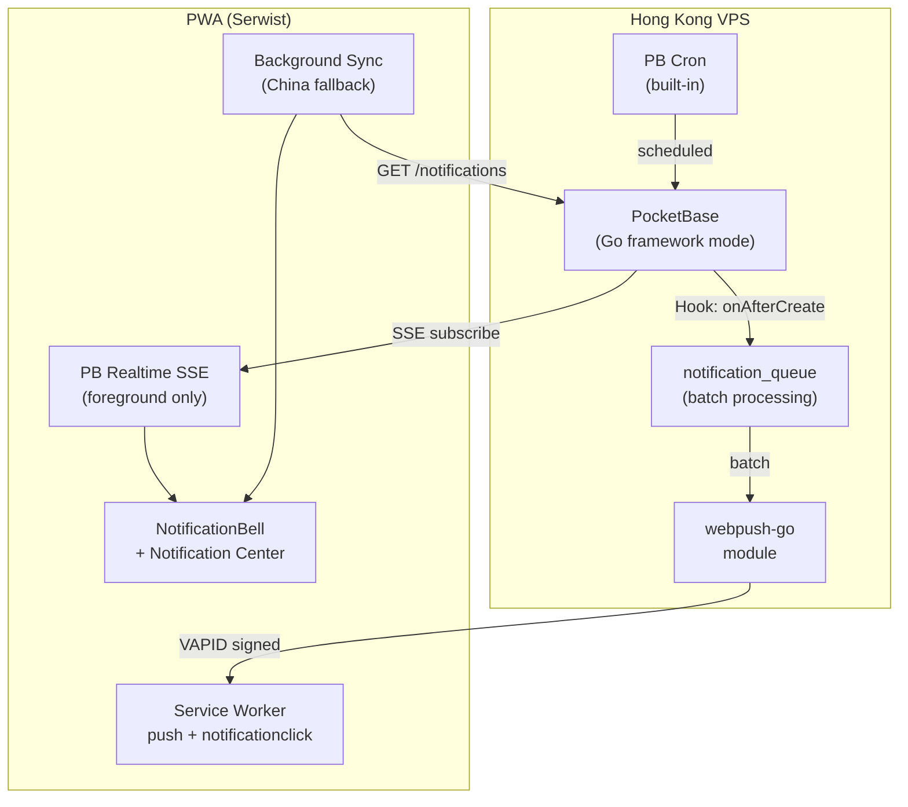

# Track 7: Push Notifications + Notification Center — Финальный План

## /switch-agent Доклад

```
🔵 Активный трек: Track 4.5 — UX Core (Exercise Catalog + Builder + Athlete)

✅ Готово (13 из 25):
- Exercise Catalog, поиск, фильтры, детальная карточка
- Coach Tips + TTS, ShowAthleteOverlay, Избранное
- QuickPlanBuilder, ExerciseConstructor, Visibility model
- AthleteDashboard, ReadinessCheckin, useAuth
- Warmup Protocols, Breathing Timer, Mental Prep

🆕 Последние изменения (CHANGELOG.md):
- Track 4.5 Phase 4: Warmup & Mental Prep (6 карточек + BreathingTimer)
- Athlete Dashboard + ReadinessCheckin + role-switch
- QuickPlanBuilder с CNS indicator + ExerciseConstructor wizard
- BottomTabBar + AuthGuard + route groups
- DS Compliance: 50+ hardcoded values → tokens

📐 План от предыдущего агента: ✅ Найден (378 строк)
📝 Walkthrough предыдущей работы: ❌ Нет

🎯 Контекст: Track 7 — НОВЫЙ трек для планирования (пост-MVP)
📋 Track 4.5 осталось: 12 пунктов
🛠 Скиллы для задачи: architecture, pwa_offline, auth_security,
   api, i18n, errors, planning
```

---

## Скиллы на каждом этапе

| Фаза | Группы skill | Конкретные скиллы |
|------|-------------|-------------------|
| **7.1 Infrastructure** | `architecture` + `auth_security` | `database-architect`, `api-security-best-practices` |
| **7.2 Client Push** | `pwa_offline` + `errors` | `mobile-developer`, `error-handling-patterns` |
| **7.3 Notification Center** | `frontend` + `ui_design` | `react-best-practices`, `jumpedia-design-system` |
| **7.4 Triggers + Cron** | `architecture` + `api` | `architecture`, `api-design-principles` |
| **7.5 China Fallback** | `pwa_offline` + `performance` | `mobile-developer`, `web-performance-optimization` |
| **7.6 Compliance** | `i18n` + `accessibility` | `i18n-localization`, `wcag-audit-patterns` |
| **Все фазы** | `always` | `concise-planning`, `lint-and-validate`, `jumpedia-design-system`, `verification-before-completion` |

---

## Архитектура гибрида



### 3 канала доставки

| # | Канал | Когда | Задержка | Китай |
|---|-------|-------|----------|-------|
| ① | **Web Push VAPID** | PWA закрыта или в фоне | ~1-3 сек | ❌ Blocked |
| ② | **PB Realtime SSE** | PWA открыта (foreground) | Мгновенно | ✅ Работает |
| ③ | **Background Sync poll** | PWA закрыта в Китае | 15 мин | ✅ Работает |

---

## Новые PB коллекции (3 штуки)

### `push_subscriptions`
| Поле | Тип | Описание |
|------|-----|----------|
| `user_id` | FK → users | Владелец подписки |
| `endpoint` | string | Push service URL |
| `p256dh` | string | Encryption key |
| `auth` | string | Auth secret |
| `user_agent` | string | Browser info |
| **INDEX** | | `idx_push_subs_user ON (user_id)` |

### `notification_preferences`
| Поле | Тип | Default |
|------|-----|---------|
| `user_id` | FK → users (UNIQUE) | — |
| `push_enabled` | bool | `true` |
| `disabled_types` | json | `[]` (массив disabled type strings) |
| `quiet_hours_start` | string | `"22:00"` |
| `quiet_hours_end` | string | `"08:00"` |
| `timezone` | string | `"UTC+3"` |

> [!TIP]
> `disabled_types: json[]` вместо 17 boolean полей — масштабируется при добавлении новых типов без миграции.

### Расширение `notifications`
| Новое поле | Тип | Описание |
|-----------|-----|----------|
| `priority` | enum: `normal` / `urgent` | Urgent = bypasses quiet hours |
| `link` | string (уже есть) | Deep link для navigation |
| `expires_at` | datetime (nullable) | Для TTL / auto-cleanup |

---

## Фазы реализации с учётом багов

### 7.1: Infrastructure (1-2 дня)
**Skills:** `database-architect`, `api-security-best-practices`

- [ ] PB → Go framework mode (если ещё standalone binary)
- [ ] Коллекция `push_subscriptions` + индекс
- [ ] Коллекция `notification_preferences` + UNIQUE(user_id)
- [ ] `notifications` — добавить `priority`, `expires_at`
- [ ] VAPID keys: `webpush.GenerateVAPIDKeys()` → `.env`
- [ ] Go push module (pb_hooks): `sendPush(subscription, payload)`
- [ ] Zod схемы: `PushSubscriptionSchema`, `NotificationPreferencesSchema`
- [ ] PB API Rules: push_subscriptions — `@request.auth.id = user_id`

**🐛 FIX BUG-5 тут:** `notifications.ts` — перейти на `pb.filter()`:
```typescript
filter: pb.filter('user_id = {:userId} && read = false', { userId })
```

**🐛 FIX BUG-3 тут:** Cron cleanup job:
```go
app.Cron().MustAdd("cleanup_notifs", "0 3 * * 0", cleanOldNotifications)
// Удалять read + старше 90 дней, + expired (expires_at < now)
```

---

### 7.2: Client Push (1-2 дня)
**Skills:** `mobile-developer`, `error-handling-patterns`

- [ ] `sw.ts` — добавить `push` event handler:
```typescript
self.addEventListener('push', (event) => {
    const data = event.data?.json();
    event.waitUntil(self.registration.showNotification(data.title, {
        body: data.body, icon: '/icon-192.png', data: { url: data.link }
    }));
});
self.addEventListener('notificationclick', (event) => {
    event.notification.close();
    event.waitUntil(clients.openWindow(event.notification.data.url));
});
```
- [ ] `usePushSubscription` hook — subscribe/unsubscribe + save to PB
- [ ] `PushPermissionPrompt.tsx` — smart timing (после 2+ визитов), user gesture
- [ ] iOS onboarding: "Добавьте на Home Screen" подсказка

**🐛 FIX BUG-1 тут:** Новый batch endpoint вместо N+1:
```go
// PB hook: POST /api/custom/mark-all-read
app.OnBeforeServe().Add(func(e *core.ServeEvent) error {
    e.Router.POST("/api/custom/mark-all-read", func(c echo.Context) error {
        userId := c.Get("authRecord").(*models.Record).Id
        _, err := app.Dao().DB().NewQuery(
            "UPDATE notifications SET read = true WHERE user_id = {:uid} AND read = false",
        ).Bind(dbx.Params{"uid": userId}).Execute()
        return c.JSON(200, map[string]bool{"ok": err == nil})
    }, apis.RequireRecordAuth())
})
```

---

### 7.3: Notification Center (1-2 дня)
**Skills:** `react-best-practices`, `jumpedia-design-system`

- [ ] Расширить `NotificationBell.tsx` → пагинация (не `getFullList`!)
- [ ] `/[locale]/notifications` — полная страница с фильтрами + deep links
- [ ] PB Realtime SSE подписка (мгновенные in-app):
```typescript
pb.collection('notifications').subscribe('*', (e) => {
    if (e.record.user_id === userId) void load();
});
```
- [ ] Notification grouping logic (3 achievement → "3 новых достижения")

**🐛 FIX BUG-2 тут:** `getFullList` → `getList(1, 20)` с пагинацией
**🐛 FIX BUG-4 тут:** SSE подписка для real-time updates

---

### 7.4: Triggers + Types + Preferences (2-3 дня)
**Skills:** `architecture`, `api-design-principles`

- [ ] `NotificationTypeSchema` → 17 типов (расширить Zod enum)
- [ ] PB hooks для каждого триггера:
  - `plan_published`: onAfterUpdate plans (status → published)
  - `low_readiness`: onAfterCreate daily_checkins (score < 50)
  - `achievement`: onAfterCreate achievements
  - `invite_accepted`: onAfterCreate athletes
- [ ] Cron jobs:
  - `checkin_reminder`: `"0 5 * * *"` (8:00 MSK) — проверка timezone
  - `competition_upcoming`: `"0 6 * * *"` (9:00 MSK)
  - `invite_expiring`: `"0 12 * * *"`
- [ ] Notification Preferences UI в Settings:
  - Toggle per type (или группами)
  - Quiet hours slider
  - Timezone selector
- [ ] Preference check в Go push module перед отправкой

**🐛 FIX BUG-7 тут:** Timezone-aware cron:
```go
// Группировка по timezone из notification_preferences
// Или: cron каждые 30 мин, проверять "сейчас 8:00 в timezone юзера?"
```

---

### 7.5: Chinese Fallback (1 день)
**Skills:** `mobile-developer`, `web-performance-optimization`

- [ ] SW: Periodic background check (15 min interval)
- [ ] Координация foreground/background (SSE vs polling)
- [ ] In-app badge count обновляется при каждом открытии PWA
- [ ] Тест без Google services → уведомления приходят через in-app + poll

**🐛 FIX BUG-6 тут:** Debounce: если PWA active → SSE, иначе → poll

---

### 7.6: Compliance + i18n (1 день)
**Skills:** `i18n-localization`, `wcag-audit-patterns`, `jumpedia-design-system`

- [ ] i18n: 17 типов × 3 языка (RU/EN/CN) в messages/*.json
- [ ] DS: все UI компоненты по `tokens.css`
- [ ] iOS: Add to Home Screen → push permission → тест
- [ ] China audit: zero external scripts (`scripts/china-audit.sh`)
- [ ] ARIA: notification center accessible
- [ ] `pnpm build + type-check + lint + test` — ✅ pass

---

## Нагрузка

| Метрика | Значение |
|---------|----------|
| Записей/день | ~174 |
| SQL queries/день | ~1,760 (с BG Sync Китай) |
| QPS | 0.02 (SQLite: 10,000+ QPS чтения) |
| Данные/год | ~18 MB |
| **Вердикт** | 🟢 Минимальная нагрузка |

## Оценка

| Фаза | Дни | Сложность |
|------|-----|-----------|
| 7.1 Infrastructure | 1-2 | 🟡 Medium |
| 7.2 Client Push | 1-2 | 🟡 Medium |
| 7.3 Notification Center | 1-2 | 🟢 Easy |
| 7.4 Triggers + Preferences | 2-3 | 🟡 Medium |
| 7.5 Chinese Fallback | 1 | 🟢 Easy |
| 7.6 Compliance | 1 | 🟢 Easy |
| **Итого** | **7-12 дней** | |

## Зависимости

> [!WARNING]
> **Track 7 НЕ блокирует MVP.** Порядок: 4.5 (Active) → 5 (Video) → 6 (Polish/MVP) → **7 (Notifications = пост-MVP)**
>
> Но BUG-1 (N+1 markAllRead) и BUG-2 (getFullList) стоит пофиксить в текущем Track 4.5, они в production-коде уже сейчас.
