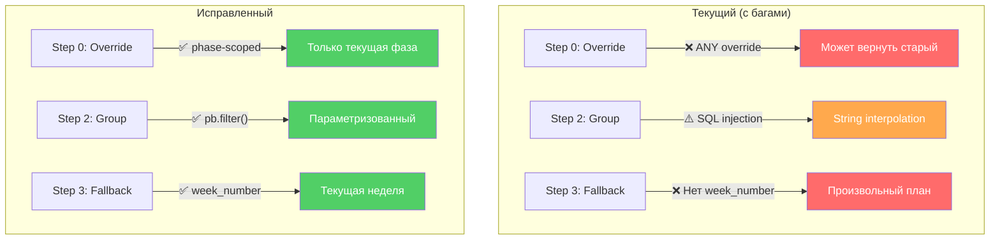

# Walkthrough — Track 4.25: Plan Resolution & Assignment Fixes

> **Статус:** ~~Absorbed into Track 4.24~~ — этот трек объединён с 4.24 (Unified UX System Redesign & Plan Resolution).  
> **Дата аудита:** 2026-02-23  
> **Skills used:** `brainstorming`, `kaizen`, `architect-review`, `systematic-debugging`

---

## Что было сделано

Провели глубокий аудит системы **Атлеты → Планы → Группы** — полный code review 7 ключевых файлов сервисного слоя и 4 UI-компонентов. Результат — структурированный отчёт с приоритизированными находками, который лёг в основу расширения Track 4.24.

---

## Ключевые решения и размышления

### 1. Два `createIndividualOverride` — почему это критично

Обнаружили **два** метода `createIndividualOverride` с разной семантикой:

| Файл | Механизм | Resolution visibility |
|------|----------|----------------------|
| `plans.ts` L296 | Ставит `parent_plan_id` + `athlete_id` | ✅ Видим для Step 0 |
| `planAssignments.ts` L157 | `duplicatePlan()` + `assignPlanToAthlete()` | ❌ Невидим для Step 0 |

**Решение:** Версия в `planAssignments.ts` — мёртвый код. `WeekConstructor.tsx` (L234) уже импортирует из `plans.ts`. Нужно удалить вместе с `duplicatePlan()`.

**Риск:** Любой будущий агент может импортировать «сломанную» версию по автокомплиту — она экспортируется с тем же именем. Удаление — единственный safe path.

---

### 2. Plan Resolution Chain — анализ 4-step waterfall

Функция `getPublishedPlanForToday(athleteId)` в `logs.ts` реализует 4-ступенчатый waterfall:

```
Step 0: Individual Override → training_plans WHERE athlete_id + parent_plan_id
Step 1: Direct Assignment   → plan_assignments WHERE athlete_id
Step 2: Group Assignment    → plan_assignments WHERE group_id IN (athlete's groups)
Step 3: Season Fallback     → seasons → phases → plans (by date range)
```

**Найденные проблемы:**

- **Step 0** не scoped по фазе — `getPublishedOverrideForAthlete` ищет ANY published override для атлета. Если в прошлом сезоне остался published override — он перекроет текущий план. Fix: добавить `phase_id.start_date <= today && phase_id.end_date >= today`.

- **Step 2** содержит SQL injection — group IDs интерполируются как строки: `group_id = "${id}"`. Хотя IDs приходят из PB (и теоретически безопасны), это anti-pattern по Kaizen/Poka-Yoke. Fix: `pb.filter()` с named params.

- **Step 3** не фильтрует по `week_number` — если в фазе несколько published планов для разных недель, вернётся произвольный (зависит от порядка в PB). Fix: вычислять текущую неделю от `phase.start_date`.

**Решение по архитектуре:** Вынести весь resolution в отдельный `planResolution.ts` (SRP). `logs.ts` сохранит re-export для backward compatibility.

---

### 3. Timezone — UTC vs. local time

`todayISO()` возвращает UTC-дату. Для атлетов в Китае (UTC+8) утром (00:00-08:00 UTC) это **вчера**. Может показать неправильный план.

**Решение:** `todayForUser(timezone?: string)` helper с `Intl.DateTimeFormat('en-CA')` — `en-CA` нативно возвращает YYYY-MM-DD формат. Fallback на UTC если timezone невалиден.

```typescript
export function todayForUser(timezone?: string): string {
    if (!timezone) return new Date().toISOString().split('T')[0];
    try {
        return new Intl.DateTimeFormat('en-CA', { timeZone: timezone }).format(new Date());
    } catch {
        return new Date().toISOString().split('T')[0];
    }
}
```

**Откуда брать timezone:** `groups.timezone` (тренер задаёт при создании группы) или `notification_preferences.timezone` (атлет задаёт в Settings).

---

### 4. Assignment lifecycle — stale assignments

При публикации нового плана (Week 3) assignment от Week 1 остаётся `active`. Атлет через Step 1/2 может получить **старый** план.

**Решение:** В `publishPlan()` после публикации — auto-deactivate все assignments от других планов той же фазы. Это хирургический fix — не трогаем assignments из других фаз.

---

### 5. Assign UX — почему тренер «стреляет вслепую»

Текущий flow:
1. Тренер нажимает «Assign» на PhaseCard
2. Выбирает группу/атлета из dropdown
3. Нажимает «Assign»
4. Система берёт **первый** published план фазы и назначает

**Проблемы:**
- Тренер не видит, **какой** план назначается (Week 1? Week 3?)
- Тренер не видит **существующие** assignments
- Нет возможности **снять** assignment из UI
- `find()` возвращает первый published — если Week 1 и Week 3 оба published, назначится Week 1

**Предложение:** Показывать «Assigning: Week N» + список текущих assignments с unassign кнопкой + проверка на дубликаты.

---

### 6. Решение об объединении с Track 4.24

Track 4.24 (Training Planning UX Redesign) уже содержит масштабную переработку тренировочного UI. Логично объединить:
- Phase 0-2 из 4.25 (backend fixes) → интегрировать в ранние фазы 4.24
- Phase 3-4 из 4.25 (assignment validation + UX) → интегрировать в UX-фазы 4.24

Это позволяет:
- Не делать двойную работу по SeasonDetail.tsx (который перерабатывается в 4.24)
- Тестировать resolution fixes вместе с новым UI
- Избежать merge конфликтов между параллельными треками

---

## Файлы для будущих агентов

| Файл | Зачем читать |
|------|-------------|
| [audit_athletes_plans.md](file:///Users/bogdan/.gemini/antigravity/brain/bb1de8af-301e-4c70-b7ff-b1beb91ed0cc/audit_athletes_plans.md) | Полный аудит с diagram и таблицами приоритетов |
| [context.md](file:///Users/bogdan/antigravity/skills%20master/tf/conductor/tracks/track-4.25-plan-resolution-fixes/context.md) | Scope, зависимости, затрагиваемые файлы |
| [implementation_plan.md](file:///Users/bogdan/antigravity/skills%20master/tf/conductor/tracks/track-4.25-plan-resolution-fixes/implementation_plan.md) | Детальные диффы, file-by-file, verification plan |
| [gate.md](file:///Users/bogdan/antigravity/skills%20master/tf/conductor/tracks/track-4.25-plan-resolution-fixes/gate.md) | Чеклист задач (30 items, 6 фаз) |

---

## Mermaid: Resolution Chain (текущий vs. исправленный)


