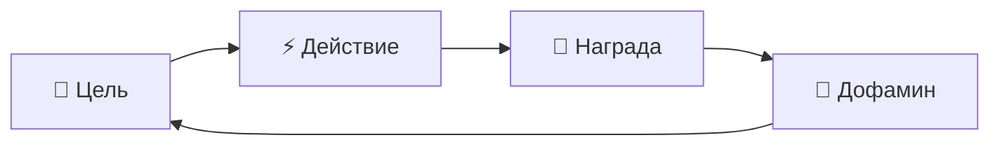
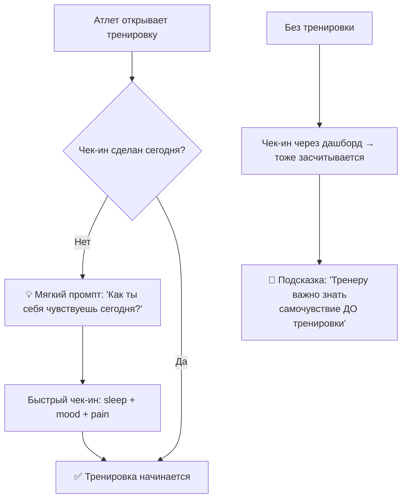
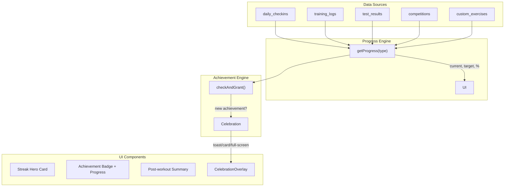

# 🎮 Исследование геймификации для Jumpedia

> **Скиллы**: brainstorming, kaizen  
> **Источники**: Octalysis Framework, Duolingo, Strava, Nike Run Club, научные исследования по спортивной психологии

> [!NOTE]
> **Это исследование повлияло на `implementation_plan.md` (v2).** Ключевые инсайты:
> - Психология dopamine loops → celebration system с fullscreen overlay + toast + haptic + sound
> - Zeigarnik effect → progress bars на locked ачивках (видишь незавершённое → мотивирует)
> - Loss aversion → evening streak warning (если чек-ин не сделан в ≥18:00)
> - Анализ Duolingo → streak hero card на дашборде
> - Анализ Strava → post-workout summary card (социальное подкрепление)
> - Octalysis (Epic meaning + Development) → 13 типов ачивок в 4 категориях вместо 5 бинарных
> - Анализ Nike Run Club → pre-training checkin prompt
>
> Исследование **сохранено полностью** как справочный материал для будущих треков.

---

## 1. Психология: почему геймификация работает

### Dopamine Loop (петля дофамина)


Каждое действие (чек-ин, тренировка, тест) → мгновенная обратная связь → выброс дофамина → желание повторить. **Ключ: награда должна быть НЕМЕДЛЕННОЙ.**

### Zeigarnik Effect (эффект незавершённого)
Прогресс-бар `████░░░░ 4/7` создаёт **навязчивое желание завершить** задачу. Мозг не может «отпустить» незаконченное действие. Duolingo использует это для стриков — юзеры возвращаются, чтобы не потерять прогресс.

### Loss Aversion (страх потери)  
Потеря стрика **в 2-2.5 раза болезненнее**, чем радость от его получения. Duolingo показывает «🔥 Streak at risk!» — это их самый мощный ретеншн-механизм.

### Octalysis: 4 релевантных драйвера для Jumpedia

| Драйвер | Описание | Наш триггер |
|---------|----------|-------------|
| **Development & Accomplishment** | Прогресс, мастерство | Прогресс-бары, бейджи, PB |
| **Ownership & Possession** | «Моя» коллекция | Коллекция бейджей, «мой» стрик |
| **Loss & Avoidance** | Страх потерять | Стрик, предупреждения |
| **Unpredictability & Curiosity** | Сюрпризы | Surprise celebrations, скрытые ачивки |

> [!IMPORTANT]
> НЕ используем Social Influence (leaderboard) — у нас coach→athlete модель, а не соц.сеть. НЕ используем Scarcity — у нас нет «редких» наград.

---

## 2. Анализ лучших: что украсть

### 🟢 Duolingo — Мастер стриков

**Что делает гениально:**
- **Стрик = центр вселенной.** Огромная цифра 🔥 на главной. Эмоциональная привязка
- **Streak Freeze** — «страховка» от потери стрика (платная)
- **Milestone celebrations** — каждые 10/50/100/365 дней — отдельный экран с конфетти
- **Loss screen** — потерял стрик → грустная сова → мотивация восстановить
- **Weekly reports** — «Ты в Top 7% всех учеников за эту неделю»

**Что берём для Jumpedia:**
- ✅ Стрик как hero-элемент на дашборде
- ✅ Milestone celebrations (7, 30, 100 дней)
- ✅ Предупреждение при риске потери стрика

### 🟠 Strava — Бейджи за милестоуны

**Что делает гениально:**
- **Multi-stage badges**: 10km → 50km → 100km → 1000km (разные бейджи за объём)
- **Personal Best автоматически**: каждый новый PB → отдельная карточка с конфетти
- **Year in Sport** — итоговый отчёт за год (epic summary)
- **Segment Efforts** → локальные рекорды

**Что берём для Jumpedia:**
- ✅ Multi-stage ачивки для объёма (10 → 50 → 100 тренировок)
- ✅ Автоматическое celebration при PB
- ✅ «Все тесты сданы» как коллекционная ачивка

### 🔴 Nike Run Club — Первые шаги

**Что делает гениально:**
- **First Run celebration** — первая тренировка = огромный party-screen
- **Streak achievements** — визуально красивые, анимированные
- **Badge collection page** — коллекция как «витрина трофеев»
- **Coach integration** — тренер поздравляет с достижениями

**Что берём для Jumpedia:**
- ✅ «Первая тренировка» как wow-момент
- ✅ Красивая коллекция бейджей  
- ✅ Нотификация тренеру при ачивке атлета

---

## 3. Одобренные триггеры: как обыграть каждый

### 🔥 3.1. Streak (Стрик чек-инов)

**Текущее:** Считает подряд идущие дни чек-инов.

**Улучшение по твоему запросу:** Чек-ин привязан к тренировке. Идеальный flow:



**WOW-эффект: Streak Hero Card**
```
┌──────────────────────────────┐
│  🔥  12 ДНЕЙ ПОДРЯД          │ ← огромная цифра, пульсирует
│  ████████████░░░░░  12/30    │ ← до следующей ачивки
│                              │
│  🏔️ Следующая: 30 дней       │
│  📈 Рекорд: 23 дня           │ ← мотивация побить
│  ⚠️ Не забудь сегодня!       │ ← if evening + no checkin
└──────────────────────────────┘
```

**Ачивки стрика:**
| Ачивка | Иконка | Target | WOW-момент |
|--------|--------|--------|------------|
| Начало пути | 🌱 | 3 дня | Toast |
| Неделя силы | 🔥 | 7 дней | Full-screen + confetti |
| Железная воля | ⚡ | 30 дней | Full-screen + special badge |
| Легенда | 💎 | 100 дней | EPIC celebration + notify coach |

### 💪 3.2. Тренировки

**«Первая тренировка»** — мощнейший WOW-момент:
```
┌────────────────────────────────┐
│                                │
│     🎉 ОТЛИЧНОЕ НАЧАЛО!       │ ← full-screen overlay
│                                │
│        💪 First Workout        │
│     Твоя первая тренировка    │
│       записана в историю!     │
│                                │
│    ┌─────────────────────┐    │
│    │  ← confetti rain →  │    │
│    └─────────────────────┘    │
│                                │
│        [ Отлично! 🚀 ]        │
└────────────────────────────────┘
```

**«Тренировка завершена» — как обыграть?**

Идеи:
1. **Post-workout summary card** — при нажатии «Завершить» показать «итоги тренировки»:
   - ⏱ Длительность
   - 💪 Упражнений: 5
   - 🔄 Подходов: 18
   - 😤 RPE: 7/10
   - 🔥 Стрик: +1
   - 🎯 До «50 тренировок»: 3 осталось

2. **Completion streak** — серия ЗАВЕРШЁННЫХ тренировок (status = 'completed')  
   Не путать с чек-ин стриком. Это «ты не бросаешь на полпути».

3. **Consistency rating** — % завершённых тренировок за последние 4 недели:
   - 🟢 80%+ = «Machine Mode»
   - 🟡 50-80% = «В процессе»
   - 🔴 <50% = «Нужна поддержка»

**Рекомендация: вариант 1 (Post-workout summary)** — максимум WOW при минимуме кода.

**Ачивки тренировок:**
| Ачивка | Иконка | Target | Прогресс |
|--------|--------|--------|----------|
| Первая тренировка | 🏋️ | 1 | done/not |
| Десятка | 🎯 | 10 | workoutCount / 10 |
| Полтинник | 💪 | 50 | workoutCount / 50 |
| Сотня | 🏆 | 100 | workoutCount / 100 |

**Время тренировки (по твоему запросу):**  
Добавить поле `started_at` в `training_logs`:
- При открытии тренировки → записать время начала
- При завершении → записать `duration_min = (now - started_at) / 60`
- Показывать в post-workout summary

### 🏆 3.3. Тестирования

**«Все тесты сданы» (твой запрос):**
Просто: если `DISTINCT test_type` по атлету = кол-ву типов в `ALL_TEST_TYPES` → бейдж.  
Бейдж даётся **один раз**, потом не повторяется.

```typescript
// Логика
const completedTypes = new Set(results.map(r => r.test_type));
const allTypes = ALL_TEST_TYPES; // ['standing_jump', 'sprint_30m', ...]
const progress = completedTypes.size;
const target = allTypes.length;
const isComplete = progress >= target;
```

**Ачивки тестов:**
| Ачивка | Иконка | Target |
|--------|--------|--------|
| Первый тест | 📊 | 1 тест записан |
| Личный рекорд! | 🥇 | 1 PB |
| Рекордсмен | 🏅 | 5 PB |
| Полный профиль | 🎯 | все test_type сданы |

### 🏅 3.4. Соревнования

**«Первое соревнование» + «Кол-во соревнований»:**

Триггер: когда `competition.date <= today` (соревнование прошло).  
Можно обыграть как **«боевой опыт»**:

| Ачивка | Иконка | Target | Описание |
|--------|--------|--------|----------|
| Дебют | 🎪 | 1 соревнование | «Первый выход на помост» |
| Бывалый | 🏟️ | 5 соревнований | «5 стартов за плечами» |
| Ветеран | 🏛️ | 10 соревнований | «10 стартов — уважение!» |

**WOW-идея: Post-Competition Card**  
После даты соревнования → показать карточку «Ты выступил!» с:
- Название соревнования
- Дата
- Приоритет (A/B/C)
- Бейдж «Дебют» если первое

### 🛠️ 3.5. Свои упражнения

**«Создал упражнение» + «Упражнение одобрено»:**

Это **coach-only** ачивки — отличный способ мотивировать тренеров:

| Ачивка | Иконка | Target | Для кого |
|--------|--------|--------|----------|
| Автор | ✏️ | 1 custom exercise | Coach |
| Творец | 🎨 | 10 custom exercises | Coach |
| Эксперт | ⭐ | 1 approved exercise | Coach |
| Мастер-класс | 🏛️ | 5 approved exercises | Coach |

---

## 4. Эффект WOW: Celebration System

### 4.1. Три уровня celebrations

| Уровень | Когда | Что показать | Пример |
|---------|-------|-------------|--------|
| **Toast** | Мелкие ачивки | Маленький popup внизу, 3 сек | «3 дня подряд 🌱» |
| **Card** | Средние события | Карточка с анимацией, кнопка | Post-workout summary |
| **Full-screen** | Ключевые моменты | Overlay + confetti + animation | Стрик 30 дней, первая тренировка |

### 4.2. Confetti + Animation

```css
/* Пример анимации для full-screen celebration */
@keyframes confetti-fall {
  0% { transform: translateY(-100vh) rotate(0deg); opacity: 1; }
  100% { transform: translateY(100vh) rotate(720deg); opacity: 0; }
}

@keyframes badge-reveal {
  0% { transform: scale(0) rotate(-180deg); opacity: 0; }
  50% { transform: scale(1.2) rotate(10deg); opacity: 1; }
  100% { transform: scale(1) rotate(0deg); opacity: 1; }
}

@keyframes glow-pulse {
  0%, 100% { box-shadow: 0 0 20px var(--glow-color); }
  50% { box-shadow: 0 0 40px var(--glow-color), 0 0 60px var(--glow-color); }
}
```

### 4.3. Haptic Feedback (PWA)
```typescript
// Вибрация при получении ачивки
if (navigator.vibrate) {
  navigator.vibrate([100, 50, 200]); // short-pause-long
}
```

---

## 5. Финальная система: 15 ачивок

### Полный каталог

| # | Категория | Ачивка | Иконка | Target | Celebration |
|---|----------|--------|--------|--------|-------------|
| 1 | 🔥 Streak | Начало пути | 🌱 | 3 дня | Toast |
| 2 | 🔥 Streak | Неделя силы | 🔥 | 7 дней | Full-screen |
| 3 | 🔥 Streak | Железная воля | ⚡ | 30 дней | Full-screen |
| 4 | 🔥 Streak | Легенда | 💎 | 100 дней | Full-screen + notify |
| 5 | 💪 Training | Первая тренировка | 🏋️ | 1 | Full-screen |
| 6 | 💪 Training | Десятка | 🎯 | 10 | Card |
| 7 | 💪 Training | Полтинник | 💪 | 50 | Full-screen |
| 8 | 💪 Training | Сотня | 🏆 | 100 | Full-screen |
| 9 | 🏆 Testing | Первый тест | 📊 | 1 тест | Toast |
| 10 | 🏆 Testing | Личный рекорд | 🥇 | 1 PB | Card |
| 11 | 🏆 Testing | Рекордсмен | 🏅 | 5 PB | Full-screen |
| 12 | 🏆 Testing | Полный профиль | 🎯 | все типы | Full-screen |
| 13 | 🏅 Compete | Дебют | 🎪 | 1 сорев. | Card |
| 14 | 🛠️ Coach | Автор | ✏️ | 1 упр. | Toast |
| 15 | 🛠️ Coach | Эксперт | ⭐ | 1 одобрено | Card |

### Сравнение: было → стало

```diff
 БЫЛО (5 ачивок):
- streak_7d, streak_30d — бинарные, без прогресса
- first_pb — бинарное
- volume_1000 — неточно считает
- season_complete — пользователь НЕ хочет

 СТАЛО (15 ачивок):
+ 4 streak-ачивки с прогресс-барами (3→7→30→100)
+ 4 training-ачивки с подсчётом (1→10→50→100)
+ 4 testing-ачивки (первый тест, PB, рекордсмен, все типы)
+ 1 competition-ачивка (дебют)
+ 2 coach-ачивки (автор, эксперт)
+ Celebration system: toast → card → full-screen
+ Post-workout summary card
+ Streak hero card на дашборде
+ Pre-training checkin prompt
```

---

## 6. Архитектура (высокоуровневая)



### Изменения без миграции БД
Вся логика прогресса — **client-side** вычисления. Не нужно менять схему PocketBase:
- `getProgress()` агрегирует данные из существующих коллекций
- Результат: `{ current: number, target: number, percent: number }`
- Ачивки по-прежнему сохраняются в коллекцию `achievements`
- Единственное новое поле: `started_at` в `training_logs` (для времени тренировки)

---

## 7. Приоритизация (что даст максимум WOW)

| Приоритет | Фича | WOW-фактор | Трудоёмкость | ROI |
|-----------|-------|------------|--------------|-----|
| 🔴 P0 | Streak Hero Card на дашборде | 🔥🔥🔥 | Маленькая | ⭐⭐⭐ |
| 🔴 P0 | Прогресс-бары в бейджах | 🔥🔥🔥 | Маленькая | ⭐⭐⭐ |
| 🔴 P0 | Full-screen celebration | 🔥🔥🔥🔥 | Средняя | ⭐⭐⭐ |
| 🟡 P1 | Post-workout summary | 🔥🔥 | Средняя | ⭐⭐ |
| 🟡 P1 | Pre-training checkin prompt | 🔥🔥 | Средняя | ⭐⭐ |
| 🟡 P1 | Расширение до 15 ачивок | 🔥🔥 | Средняя | ⭐⭐ |
| 🟢 P2 | Haptic feedback | 🔥 | Маленькая | ⭐ |
| 🟢 P2 | Coach notifications | 🔥 | Средняя | ⭐ |
| 🟢 P2 | Training timer (started_at) | 🔥 | Средняя | ⭐ |
