# Periodization — Энциклопедия Прыгуна v2

> Training system rules for seasons, phases, plans, readiness, and auto-adaptation.
> Referenced by CLAUDE.md — agents read this when working on Track 3 (Training System).

---

## Data Model Hierarchy

```mermaid
flowchart TD
    Season["🗓️ Season (Macrocycle)\n8-12 months"] --> Phase
    Phase["📊 Training Phase (Mesocycle)\nGPP → SPP → COMP → TRANSITION"] --> Plan
    Plan["📋 Training Plan (Microcycle)\n1 week = 7 days"] --> Exercise
    Exercise["🏋️ Plan Exercises\nWith sets, reps, intensity"]
    Season --> Competition["🏆 Competition\nA/B/C priority"]
    Plan --> Log["📝 Training Log\nAthlete fills per session"]
    Log --> LogEx["Log Exercises\nActual sets_data + RPE"]
```



### PocketBase Collections

| Collection | Purpose | Key Fields |
|-----------|---------|-----------|
| `seasons` | Macrocycle | coach_id, name, start_date, end_date |
| `training_phases` | Mesocycle | season_id, type, focus, start_date, end_date, order |
| `competitions` | Meets | season_id, name, date, priority (A/B/C) |
| `training_plans` | Weekly plan | phase_id, group_id, week_number, status, display_languages |
| `plan_exercises` | Exercises in plan | plan_id, exercise_id, day, order_index, planned_sets/reps/intensity |
| `plan_snapshots` | Version history | plan_id, snapshot (JSON), version, published_at |
| `training_logs` | Athlete daily log | athlete_id, plan_id, date, readiness_score |
| `log_exercises` | Actual performance | log_id, exercise_id, sets_data (JSON), rpe |
| `daily_checkins` | Readiness input | athlete_id, date, sleep, pain, mood |

---

## Phase Types

| Type | Duration | Focus | Volume | Intensity |
|------|----------|-------|--------|-----------|
| **GPP** (General Physical Preparation) | 6-10 weeks | Base fitness, strength | High | Low-Medium |
| **SPP** (Special Physical Preparation) | 4-6 weeks | Sport-specific power | Medium | Medium-High |
| **PRE_COMP** (Pre-Competition) | 2-3 weeks | Sharpening, speed | Low-Medium | High |
| **COMP** (Competition) | 1-3 weeks | Peak performance | Low | Maximum |
| **TRANSITION** | 2-4 weeks | Recovery, general activity | Very Low | Low |

### Phase Transition Rules
```
GPP → SPP → PRE_COMP → COMP → TRANSITION → (next season)
```
- Phases must be sequential within a season
- Each phase has `order` field for sequencing
- Validation: `end_date` of phase N ≤ `start_date` of phase N+1

---

## Exercise Tagging System

> Every exercise has 3 tags that power Auto-Fill and CNS Detection.

### Tag 1: `phase_suitability` (array)
Which phases this exercise is appropriate for:
```json
["GPP", "SPP"]           // Back Squat
["SPP", "COMP"]          // Depth Jumps
["GPP", "SPP", "COMP"]   // Sprint Drills
```

### Tag 2: `cns_cost` (enum)
Central Nervous System demand:

| Level | Examples | Recovery |
|-------|---------|----------|
| `high` | Depth Jumps, Clean & Jerk, Max Squats | 48-72h |
| `medium` | Box Jumps, Kettlebell Swings, Power Cleans | 24-48h |
| `low` | Stretching, Foam Rolling, Light Jogging | 0-24h |

### Tag 3: `training_category` (enum)
What physical quality it develops:

| Category | Examples |
|----------|---------|
| `speed` | Sprint drills, flying starts |
| `power` | Clean pulls, box jumps, plyometrics |
| `elasticity` | Depth jumps, bounding, hurdle hops |
| `max_strength` | Back squat, deadlift, bench press |
| `technical` | Approach run drills, Fosbury Flop technique |

---

## Phase-Aware Auto-Fill

> One-click button: "Fill by phase" → generates exercise selection based on current phase.

### Distribution Rules

```typescript
const PHASE_DISTRIBUTION: Record<PhaseType, Record<TrainingCategory, number>> = {
  GPP:        { max_strength: 0.60, elasticity: 0.30, technical: 0.10 },
  SPP:        { power: 0.40, elasticity: 0.30, technical: 0.30 },
  PRE_COMP:   { power: 0.30, speed: 0.30, technical: 0.40 },
  COMP:       { max_strength: 0.20, speed: 0.30, technical: 0.50 },
  TRANSITION: { max_strength: 0.20, elasticity: 0.20, technical: 0.60 },
}
```

### Auto-Fill Algorithm
```
1. Get current phase → lookup PHASE_DISTRIBUTION
2. Get available exercises where phase_suitability includes current phase
3. Filter by coach's custom_exercises (if any)
4. Select N exercises matching the target distribution
5. Avoid placing High CNS exercises on consecutive days
6. Pre-fill planned_sets, planned_reps, planned_intensity from exercise defaults
```

---

## CNS Conflict Detection

> Warns when high-CNS exercises are scheduled too close together.

### Rules
```typescript
// Warning triggers:
if (exercise.cns_cost === 'high' && nextDayExercise.cns_cost === 'high') {
  warn("⚠️ Two high-CNS exercises on consecutive days")
}

if (exercise.cns_cost === 'high' && nextDayExercise.training_category === 'technical') {
  warn("⚠️ Technical work after high-CNS day — performance may suffer")
}

// Count per week:
if (weeklyHighCNS > 3) {
  warn("⚠️ More than 3 high-CNS sessions this week")
}
```

### Visual Feedback
- 🟢 No conflicts
- 🟡 1 warning (acceptable)
- 🔴 2+ warnings (review plan)

---

## Readiness System

### Daily Check-in (10 seconds)
Athlete answers 3 questions via Traffic Light UI:

| Question | Scale | Weight |
|----------|-------|--------|
| Sleep quality | 1-5 (terrible → great) | ×8 |
| Mood/energy | 1-5 (terrible → great) | ×6 |
| Pain level | 0-10 (none → severe) | ×6 (inverted) |

### Score Formula
```typescript
function calculateReadiness(sleep: number, mood: number, pain: number): number {
  const raw = (sleep * 8) + (mood * 6) + ((10 - pain) * 6)
  // Max: 5*8 + 5*6 + 10*6 = 40 + 30 + 60 = 130
  return Math.round((raw / 130) * 100) // Normalized to 0-100
}
```

### Visual Display
```
Score > 80  → 🟢 Green  — "Ready to go"
Score 50-80 → 🟡 Yellow — "Reduced capacity"
Score < 50  → 🔴 Red    — "Recovery needed"
```

---

## Auto-Adaptation

> Automatically adjusts training plan based on readiness score.
> **Toggleable** via `coach_preferences.auto_adaptation_enabled`

### Adaptation Rules

| Readiness | Action | Example |
|-----------|--------|---------|
| **> 80** | No changes | Plan as-is |
| **60–80** | Reduce volume 20% | 5 sets → 4 sets |
| **< 50** | Substitute exercise | Depth Jumps → Box Jumps (use `alternate_exercise_id`) |

### Notifications
- Score < 50 → **Push notification to coach**: "Athlete X — Readiness 40"
- Score < 30 → **Suggest rest day** (UI warning, not enforced)

### Coach Override
```typescript
// In coach_preferences:
{
  auto_adaptation_enabled: true,   // Toggle on/off
  // When off: readiness still tracked, but no auto-changes
  // Coach sees readiness in dashboard but decides manually
}
```

---

## Competition Scheduling

### Priority System
| Priority | Meaning | Auto-actions |
|----------|---------|-------------|
| **A** | Main competition (nationals, etc.) | Full peaking protocol |
| **B** | Important secondary | Moderate volume reduction |
| **C** | Practice / minor meets | Minimal adjustment |

### Peaking Rules
```
A-meet:
  - 14 days before: Volume drops to 60%
  - 7 days before: Volume drops to 40%, intensity stays high
  - 2 days before: Light technical only
  - Day of: Competition

B-meet:
  - 7 days before: Volume drops to 80%
  - 2 days before: Reduce high-CNS exercises

C-meet:
  - 2 days before: Volume drops to 80%
  - No other changes
```

### Validation
- Peaking phase must be 2-3 weeks (warn if shorter)
- Cannot schedule A-meet during GPP phase (warn)
- Cannot schedule two A-meets within 4 weeks (warn)

---

## Unit System

> Exercises define their unit type. UI adapts automatically.

| `unit_type` | Log UI | Example | Conversion |
|-------------|--------|---------|------------|
| `reps_weight` | sets × reps × weight | Squat: 3×10×80kg | kg ↔ lbs |
| `time` | sets × duration (sec) | Plank: 3×60s | — |
| `distance` | sets × distance (m) | Sprint: 3×30m | m ↔ yd |
| `height` | attempts × height (cm) | Jump: 15×175cm | cm ↔ in |
| `bodyweight` | sets × reps | Push-ups: 3×20 | — |

### Flexible sets_data JSON
```typescript
type SetsData =
  | { type: 'reps_weight'; sets: { reps: number; weight: number }[] }
  | { type: 'time'; sets: { duration: number }[] }
  | { type: 'distance'; sets: { distance: number }[] }
  | { type: 'height'; attempts: { height: number; result: 'made'|'miss' }[] }
  | { type: 'bodyweight'; sets: { reps: number }[] }
```

---

## Performance Tests

| Test | Measures | Unit | Frequency |
|------|----------|------|-----------|
| **HJ** (High Jump) | Competition result | cm | Per competition |
| **CMJ** (Counter Movement Jump) | Lower body power | cm | Weekly |
| **SJ** (Squat Jump) | Reactive strength | cm | Weekly |
| **30m Sprint** | Acceleration | seconds | Bi-weekly |
| **Squat Max** | Max strength | kg | Monthly |

### Benchmark Comparisons
- Age-adjusted standards (maturity benchmarks)
- Historical progression graphs (Recharts)
- `test_results` collection with UNIQUE(athlete_id, test_type, date)

---

## Season Wizard UI Flow

```mermaid
flowchart TD
    Start["Create Season"] --> Dates["Set start/end date"]
    Dates --> Phases["Add phases:\nGPP → SPP → PRE_COMP → COMP → TRANSITION"]
    Phases --> Validate{"Dates valid?\nPhases fit?"}
    Validate -->|No| Fix["Fix overlaps"]
    Fix --> Phases
    Validate -->|Yes| Comps["Add Competitions\n(A/B/C priority)"]
    Comps --> Gantt["Gantt Timeline Preview"]
    Gantt --> Save["Save Season"]
```



---

*This document is the source of truth for all periodization logic. When implementing Track 3, follow these rules exactly.*
