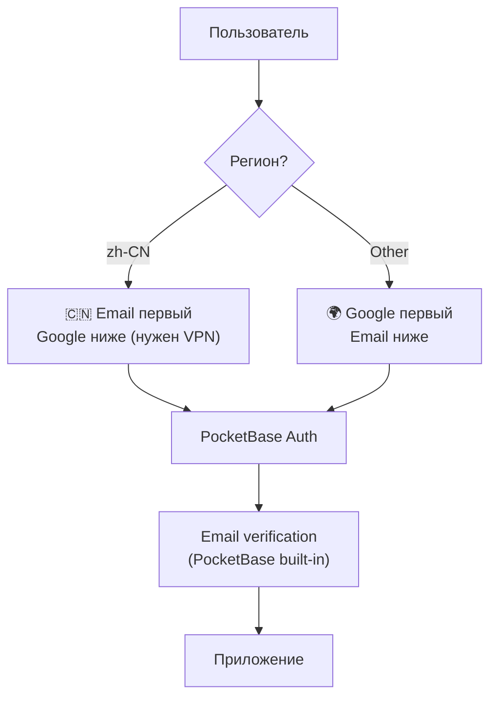

# Security — Энциклопедия Прыгуна v2

> Auth flow, security headers, CORS, rate limiting.
> Referenced by CLAUDE.md — agents read this for Track 2 (Auth + Data).

---

## Authentication Flow



### Auth Methods
| Method | Primary For | PocketBase config |
|--------|------------|-------------------|
| **Email + Password** | 🇨🇳 China users | Built-in auth collection |
| **Google OAuth2** | 🌍 Global users | OAuth2 provider in PocketBase |

### Email Verification
- PocketBase sends verification email automatically
- SMTP configured via PocketBase Admin → Settings → Mail
- Custom email templates with branding

### Password Reset
- PocketBase built-in reset flow
- Rate limited: 3 requests / 15 minutes

---

## API Rules (21 Collections)

### Pattern: Coach Access
```javascript
// Coach sees only their data:
@request.auth.id = coach_id

// Coach sees athlete data through group membership:
@request.auth.id = athlete_id.coach_id
```

### Pattern: Athlete Access
```javascript
// Athlete sees only own data:
@request.auth.id = athlete_id

// Athlete reads plans published to their group:
@request.auth.id != "" && 
  group_id.group_members_via_group_id.athlete_id ?= @request.auth.id
```

### Pattern: Admin Only
```javascript
// error_logs, audit_log — no client access:
// List/Create/Update/Delete rules: "" (empty = denied)
// Admin-only via PocketBase Admin UI
```

### Full Rules Matrix

| Collection | List | Create | Update | Delete |
|-----------|------|--------|--------|--------|
| `users` | own | — | own | — |
| `athletes` | coach | coach | coach | coach (soft) |
| `groups` | coach | coach | coach | coach (soft) |
| `group_members` | coach | coach | coach | coach |
| `coach_preferences` | own | own | own | — |
| `seasons` | coach | coach | coach | coach (soft) |
| `training_phases` | coach | coach | coach | coach (soft) |
| `competitions` | coach | coach | coach | coach (soft) |
| `training_plans` | coach+athletes | coach | coach | coach (soft) |
| `plan_exercises` | coach+athletes | coach | coach | coach (soft) |
| `plan_snapshots` | coach+athletes | coach | — | — |
| `exercises` | all auth | admin | admin | — |
| `custom_exercises` | coach | coach | coach | coach |
| `training_logs` | coach+athlete | athlete | athlete | — |
| `log_exercises` | coach+athlete | athlete | athlete | — |
| `daily_checkins` | coach+athlete | athlete | athlete | — |
| `test_results` | coach+athlete | athlete | athlete | — |
| `exercise_videos` | all auth | coach | coach | coach |
| `athlete_videos` | coach+athlete | athlete | coach+athlete | coach |
| `achievements` | own | system | — | — |
| `notifications` | own | system | own (read) | own |
| `error_logs` | — | auth | — | — |
| `audit_log` | admin | system | — | — |

---

## Security Headers

```javascript
// pb_hooks/security_headers.pb.js
routerUse((e) => {
  e.response.header().set("X-Content-Type-Options", "nosniff")
  e.response.header().set("X-Frame-Options", "DENY")
  e.response.header().set("Strict-Transport-Security", "max-age=31536000; includeSubDomains")
  e.response.header().set("X-XSS-Protection", "1; mode=block")
  e.response.header().set("Referrer-Policy", "strict-origin-when-cross-origin")
  e.response.header().set("Permissions-Policy", "camera=(), microphone=(), geolocation=()")
  return e.next()
})
```

---

## CORS Configuration

```javascript
// PocketBase Admin → Settings → Application
// Allowed origins (NOT "*"):
[
  "https://yourdomain.com",
  "https://www.yourdomain.com",
  "http://localhost:3000"  // dev only
]
```

---

## Rate Limiting

| Endpoint | Limit | Window |
|---------|-------|--------|
| Login | 5 attempts | 15 min |
| Registration | 3 attempts | 15 min |
| Password reset | 3 attempts | 15 min |
| Invite code | 10 attempts | 15 min |
| API (general) | 100 requests | 1 min |

---

## Data Protection

### Soft Delete
All collections with `deleted_at` field. Records are never physically deleted.

### Backups
- Daily SQLite snapshot → Cloudflare R2
- Retention: 30 days
- Restore procedure documented in Track 1 gate

### Encryption
- HTTPS everywhere (Cloudflare or Let's Encrypt)
- PocketBase stores passwords with bcrypt
- No sensitive data in IndexedDB (tokens only in memory/httpOnly cookies)

---

## China-Specific

| Rule | Why |
|------|-----|
| No external CDNs | Blocked by GFW |
| No Google Fonts CDN | Self-host in `/public/fonts/` |
| No analytics scripts | May be blocked |
| Email auth primary | Google OAuth needs VPN |
| Self-hosted MediaPipe WASM | CDN unreliable in China |
| `Cache-Control: immutable` on .wasm | Avoid re-downloads |
